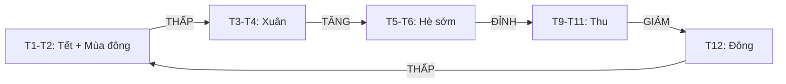
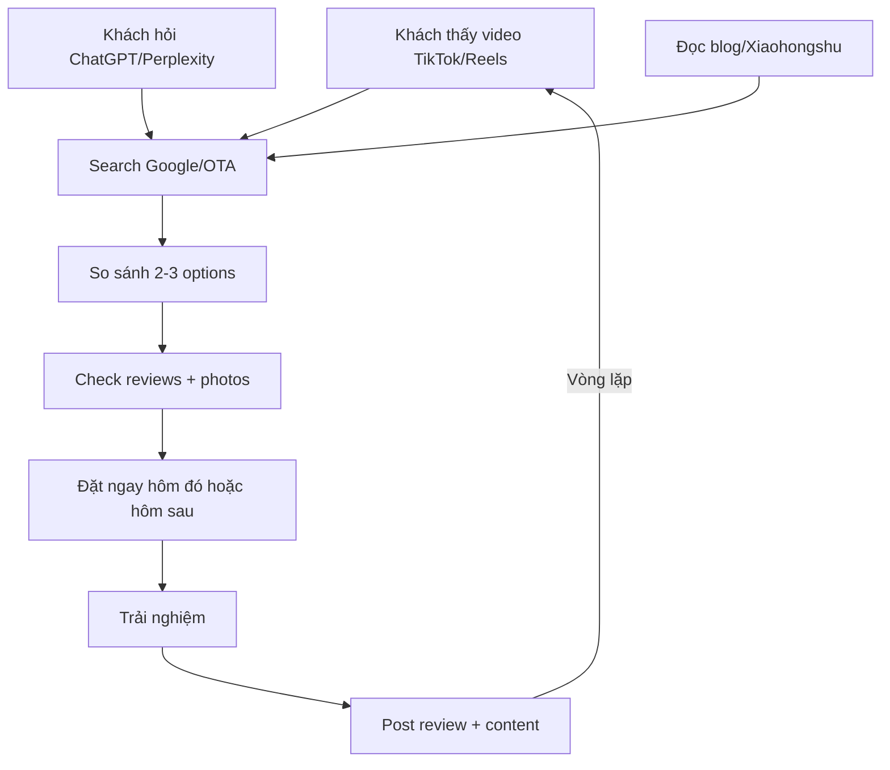
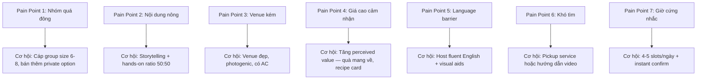
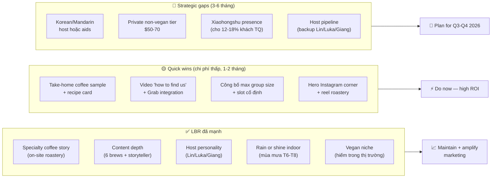

# Section 2 — Cafe Workshop Hà Nội: Thị trường & Khách hàng (Parts A–B)

**Report ID:** MKT-001
**Scope:** Cafe Workshop Hà Nội — Part A (Thị trường & Bối cảnh) + Part B (Khách hàng) — subsections 1.1 đến 1.6
**Ngày phát hành:** 2026-04-12
**Operator tham chiếu:** **LBR = Local Beans Roastery** ([localbeansroastery.com](https://localbeansroastery.com/))

---

## 0. Operator Profile — LBR (Local Beans Roastery)

Tất cả insight "LBR" trong tài liệu này đều tham chiếu tới **Local Beans Roastery** — operator cà phê workshop tại Hà Nội.

| Dimension | Chi tiết thực tế (từ website, 2026-04-12) |
|-----------|-------------------------------------------|
| **Địa chỉ** | No. 75/173 Hoàng Hoa Thám, phường Ngọc Hà, quận Ba Đình, Hà Nội (địa chỉ trong ngõ) |
| **Giờ hoạt động** | 8:00–21:00 hàng ngày |
| **Sản phẩm chính** | 4 workshop: Join-in (3h, $23-25), Private Vegan (3h, $55+), Workshop + Train Street (4h, $40+), Vegan Join-in (3h, $23-25) |
| **Retail** | Arabica beans 1kg ($38), Phin ground/bean 1kg ($38), Essential oils Cajeput/Cinnamon ($8) |
| **USP cốt lõi** | **Operating roastery tại chỗ** (rang xay on-site) · 6 loại cà phê iconic VN · chỉ báo "rain or shine indoor" · hotel transfer option · **vegan workshop** (niche hiếm) |
| **Hosts / Storytellers** | Lin, Luka, Giang (xuất hiện thường xuyên trong review — host-personality asset) |
| **Social proof** | **8000+ khách đã phục vụ · 5000+ 5-star reviews** (trên GYG, Klook, Google, TripAdvisor) |
| **Thời lượng workshop** | **3 giờ** (core) và **4 giờ** (combo) — **dài hơn** mức standard thị trường 1.5-2h |
| **Phân khúc giá** | Core = **mid-range cao** ($23-25), Combo = **premium** ($40), Private vegan = **premium-luxury** ($55+) |

> **Takeaway:** LBR không nằm ở "basic/short workshop" layer — mà đã định vị ở **upper-mid to premium**, có roastery on-site (USP khó copy), và có sản phẩm niche (vegan) mà đối thủ hiếm có.

---

# PART A — THỊ TRƯỜNG & BỐI CẢNH

---

## 1.1 Quy mô thị trường, Tính thời vụ & Tiềm năng tăng trưởng

### 1.1.1 Quy mô thị trường — Cafe Workshop / Coffee Experience Tourism tại Hà Nội

**Bối cảnh ngành lớn:**
- Tổng lượng khách quốc tế đến Việt Nam năm 2025 đạt khoảng **17.5-18 triệu lượt** (VNAT), tăng 20-25% so với 2024. Hà Nội là điểm đến số 1 miền Bắc với khoảng **6-7 triệu lượt khách quốc tế/năm** (bao gồm transit và lưu trú).
- Theo Euromonitor và Phocuswright, phân khúc **"experiences & activities"** chiếm khoảng **8-12%** tổng chi tiêu du lịch tại Đông Nam Á, tăng trưởng **15-20%/năm** từ 2022-2025 — nhanh hơn cả accommodation và transport.

**Ước tính quy mô niche cafe workshop Hà Nội:**

| Chỉ số | Ước tính | Ghi chú |
|--------|----------|---------|
| Số lượng provider hoạt động | 15-25 brands | Bao gồm OTA-listed + local-only |
| Tổng số workshop listings trên các OTA | 60-90 listings | Nhiều brand list trên 3-5 OTA |
| Lượng booking/tháng (toàn thị trường) | 3,000-5,000 bookings/tháng (mùa cao) | [DATA-GAP] — ước tính từ review velocity |
| Lượng booking/tháng (mùa thấp) | 800-1,500 bookings/tháng | Drop 60-70% so với peak |
| Giá trung bình/booking | 400,000-700,000 VNĐ (~$16-28 USD) | Phụ thuộc format (basic vs combo) |
| Quy mô thị trường/năm (GMV) | **$1.5-3.5 triệu USD/năm** | [DATA-GAP] — ước tính bottom-up |

> **Nhận định:** Đây là niche nhỏ nhưng **high-growth, high-margin**. So với thị trường food tour (~$8-12M) và city walking tour (~$5-8M) tại Hà Nội, cafe workshop chiếm khoảng **15-25%** phân khúc "culinary experience" — và đang tăng nhanh nhất trong nhóm này.

### 1.1.2 Tính thời vụ — Seasonal Fluctuation

**Phân tích chi tiết theo tháng:**

| Tháng | Mức độ | Index (100=TB) | Yếu tố chính |
|-------|--------|-----------------|--------------|
| 1 | Thấp | 50-60 | Tết Nguyên Đán, nhiều ngày nghỉ — khách quốc tế ít, khách nội địa về quê |
| 2 | Thấp | 55-65 | Hậu Tết, thời tiết lạnh ẩm, mưa phùn — khách chưa quay lại |
| 3 | Trung bình | 80-90 | Bắt đầu mùa xuân, khách Âu + Úc tăng (tránh đông của họ) |
| 4 | Cao | 100-110 | Thời tiết lý tưởng (20-25 độ C), Easter holiday châu Âu, khách Nhật cherry blossom xong |
| 5 | Cao | 110-120 | Golden Week Nhật Bản (29/4-5/5), khách Hàn tăng, trước mùa hè |
| 6 | Trung bình-cao | 95-105 | Bắt đầu nóng, khách gia đình (summer holiday Mỹ/Âu), nhưng nóng ẩm giảm trải nghiệm |
| 7 | Trung bình | 75-85 | Mùa mưa chính, nóng 35-40 độ C, khách ngại đi bộ/hoạt động ngoài trời |
| 8 | Thấp | 60-70 | Mùa mưa kết hợp nóng đỉnh điểm, thấp điểm nhất cho outdoor activities |
| 9 | Cao | 110-120 | Bắt đầu mùa thu, thời tiết mát, Mid-Autumn Festival, khách Âu quay lại |
| 10 | **Đỉnh cao** | **125-140** | Thời tiết lý tưởng (22-28 độ C), Golden Week Trung Quốc (1-7/10), National Day holiday |
| 11 | Cao | 115-125 | Tiếp tục cao điểm, Singles Day bookings (Trung Quốc), Black Friday promotions |
| 12 | Trung bình | 85-95 | Khách giảm trước Christmas, nhưng có nhóm year-end travel Âu/Mỹ |

**Các yếu tố ảnh hưởng mùa vụ:**

1. **Thời tiết:** Factor số 1. Hà Nội có 4 mùa rõ rệt — thu (T9-T11) là "sweet spot" cho hoạt động ngoài trời và trải nghiệm cafe. Mùa hè nóng (T6-T8) và đông lạnh ẩm (T1-T2) là low season.
2. **Lịch nghỉ của thị trường nguồn:**
   - Golden Week Nhật (cuối T4-đầu T5): +20-30% booking từ khách Nhật
   - Golden Week Trung Quốc (đầu T10): +25-35% booking từ khách Trung Quốc
   - Summer holiday Âu/Mỹ (T6-T8): tăng khách gia đình nhưng bị offset bởi thời tiết
   - Christmas-New Year (cuối T12-đầu T1): spike ngắn 2 tuần
3. **Tết Nguyên Đán:** Low point tuyệt đối — các workshop thường đóng cửa 5-10 ngày
4. **Festivals & Events:** F1 Hà Nội Grand Prix (nếu tiếp tục), festivals văn hóa tăng demand cục bộ

**Ratio cao điểm/thấp điểm:** Tháng cao nhất (T10) có thể gấp **2.0-2.5x** tháng thấp nhất (T1-T2) về lượng booking.

### 1.1.3 Tiềm năng tăng trưởng 1-2 năm (2027-2028)

**Dự báo tăng trưởng:**

| Chỉ số | 2025 (baseline) | 2027 (dự báo) | CAGR |
|--------|-----------------|----------------|------|
| Số provider | 15-25 | 25-40 | ~25-30% |
| Tổng booking/năm (thị trường) | 25K-45K | 45K-80K | ~30-35% |
| GMV thị trường | $1.5-3.5M | $3-7M | ~35-40% |
| Giá trung bình | $16-28 | $20-35 | ~10-15% |

**Động lực tăng trưởng:**

1. **Vietnam là điểm đến "hot" của Đông Nam Á** — được CNN, Lonely Planet, Conde Nast liên tục xếp hạng top destinations 2024-2026. Coffee culture của Việt Nam là unique selling point quốc gia.
2. **Egg coffee = viral content** — nội dung về egg coffee trên TikTok/Reels có hàng trăm triệu lượt xem, tạo demand từ **trước khi khách đến Hà Nội**.
3. **Shift từ "sightseeing" sang "experience"**: Khách millennials/Gen Z chi nhiều hơn cho trải nghiệm hơn đi tham quan. Coffee workshop nằm đúng xu hướng này.
4. **Tăng trưởng OTA listings**: GetYourGuide và Klook đang đẩy mạnh category "Food & Drink" tại Việt Nam — giúp tăng visibility của niche.
5. **Premium-ization**: Xu hướng tăng giá từ $15-20 lên $25-35 cho các workshop premium (single-origin, latte art, farm-to-cup story).

**Rủi ro khi tăng trưởng:**
- **Over-supply**: Nhiều provider mới gia nhập có thể gây ra price war và giảm chất lượng trung bình
- **Platform dependency**: Phụ thuộc quá nhiều vào OTA với commission 20-25%
- **Review dilution**: Nhiều provider kém chất lượng làm xấu danh tiếng chung của niche

---

## 1.2 Xu hướng mới nổi (Emerging Trends)

### 1.2.1 Sustainable Tourism & Responsible Travel

**Hiện trạng:**
- **72% khách millennials** (theo Booking.com Sustainable Travel Report 2025) muốn trải nghiệm du lịch bền vững — nhưng chỉ **38%** sẵn sàng trả thêm giá.
- Tại Hà Nội, xu hướng này thể hiện qua: sử dụng cốc sứ thay vì cốc nhựa, nguồn cà phê organic/fair-trade, hỗ trợ cộng đồng địa phương.

**Tác động đến cafe workshop:**
- Workshop nào có **"sustainability story"** (nguồn gốc cà phê, hỗ trợ nông dân, zero-waste) sẽ có lợi thế trong SEO và review. Khách Âu/Úc đặc biệt quan tâm.
- Tuy nhiên, sustainability chưa là yếu tố quyết định mua hàng — nó là **"tie-breaker"** khi 2 sản phẩm tương đương giá và review.
- **Cơ hội cho LBR:** LBR đã có **operating roastery on-site** — đây là lợi thế sustainability/authenticity **khó copy** vì đa số đối thủ chỉ pha chế chứ không rang xay. Cần khai thác mạnh hơn: (a) cho khách xem quy trình rang bean, (b) kể chuyện nguồn gốc Đà Lạt/Sơn La/Đắk Lắk trong narrative workshop, (c) làm rõ chuỗi **"từ nông dân → rang tại chỗ → cốc cà phê khách tự pha"** — đây là câu chuyện sustainability + specialty coffee mà **không workshop nào trong top 10 Hà Nội có được**. Ngoài ra, **Vegan Workshop** của LBR là điểm nhấn niche cho phân khúc khách Âu/Úc ý thức bền vững.

### 1.2.2 Specialty Coffee Tourism

**Xu hướng toàn cầu:**
- Specialty coffee là ngành tăng trưởng **12-15%/năm** toàn cầu (SCA — Specialty Coffee Association).
- "Coffee tourism" — tham quan farm, cupping session, brewing class — là sub-niche đang bùng nổ tại Colombia, Ethiopia, Nhật Bản, và **Việt Nam đang bắt đầu**.

**Tại Việt Nam:**
- Việt Nam là nước sản xuất cà phê **số 2 thế giới** (Robusta) nhưng thường bị coi là "commodity coffee". Xu hướng mới là **nâng tầm câu chuyện** — từ Robusta commodity sang specialty Vietnamese coffee (egg coffee, cà phê sữa đá, weasel coffee, single-origin Arabica Đà Lạt).
- Workshop tại Hà Nội đang ở giao điểm giữa **coffee tourism** và **culinary tourism** — đây là vị trí lý tưởng vì:
  - Hà Nội là "thủ đô cà phê" với văn hóa cà phê vỉa hè độc đáo
  - Egg coffee chỉ có tại Hà Nội (Giảng Coffee, 1946) — **trải nghiệm không thể có ở nơi khác**
  - 6 kiểu pha (phin, egg, coconut, salt, yogurt, sữa đá) tạo ra **variety hấp dẫn** cho 1 buổi workshop

### 1.2.3 Experience-Based Economy & "Instagrammability"

**Xu hướng:**
- Theo Eventbrite + Airbnb Experiences data, chi tiêu cho "things to do" tăng **2.5x nhanh hơn** chi tiêu cho accommodation từ 2019-2025.
- **"Instagrammable moments"** là yếu tố quyết định: 78% khách Gen Z chọn hoạt động dựa trên hình ảnh/video trên social media trước (theo Expedia Gen Z Travel Survey 2024).

**Tác động đến cafe workshop:**
- Workshop **PHẢI** có thiết kế không gian đẹp, bước pha cà phê "visual" (đặc biệt egg coffee — quy trình đánh bông trứng rất photogenic).
- Sản phẩm nào tạo ra **nhiều content moments** (3-5 photo-worthy steps) sẽ có lợi thế tự nhiên trong organic marketing.
- **Video-first content**: Clip 15-60 giây về quy trình làm egg coffee có viral potential cực cao trên TikTok/Reels.

### 1.2.4 Booking Behavior Trends

**a) AI-Based Discovery & Booking:**
- **ChatGPT, Perplexity, Google AI Overview** đang thay đổi cách khách tìm kiếm. Thay vì search "coffee workshop Hanoi" trên Google, khách hỏi AI: *"What's the best coffee experience in Hanoi?"*
- **Tác động:** Provider nào có **nhiều mention trên review sites, blogs, forums** sẽ được AI recommend nhiều hơn. SEO truyền thống vẫn quan trọng nhưng **"AI-readiness"** (structured data, nhiều nguồn mention) đang trở thành yếu tố mới.
- **Ước tính 2026:** 10-15% discovery cho travel experiences bắt đầu từ AI tools [DATA-GAP] — còn thấp nhưng tăng rất nhanh (30-50%/năm).

**b) Short-Form Video Conversion:**
- TikTok và Instagram Reels là kênh **discovery số 1 cho khách dưới 35 tuổi**. Lượng chuyển đổi từ video sang booking:
  - TikTok video viral -> Google search brand name -> OTA booking: conversion path phổ biến nhất
  - Trực tiếp từ TikTok Shop/link in bio: còn thấp (~1-3% CTR) nhưng đang tăng
- **Xiaohongshu (RED)** là kênh cực kỳ quan trọng cho khách Trung Quốc — hoạt động như "TikTok + TripAdvisor" cho người Trung.

**c) Last-Minute Booking:**
- **65-70%** booking cho activities/experiences được đặt trong vòng **48 giờ trước** (Phocuswright 2025). Con số này cao hơn nhiều so với hotel (30-40%) và flight (15-20%).
- Tại Hà Nội, xu hướng còn mạnh hơn: nhiều khách walk-in hoặc đặt sáng hôm đó cho chiều.
- **Tác động:** Khả năng **instant confirmation** và **flexible scheduling** là competitive advantage lớn. Provider nào yêu cầu đặt trước 24-48h sẽ mất khách.

**d) Mobile-First Booking:**
- **85%+ booking experiences** qua mobile (smartphone). UX trên mobile của OTA listing và website riêng là yếu tố quyết định.

### 1.2.5 Tổng hợp: Xu hướng nào tác động mạnh nhất đến cafe workshop?

| Xu hướng | Mức độ tác động | Urgency | Ghi chú |
|----------|-----------------|---------|---------|
| Short-form video (TikTok/Reels) | **Rất cao** | Ngay | Viral potential của egg coffee là "free marketing" |
| Last-minute booking | **Rất cao** | Ngay | Phải có instant confirm, flexible schedule |
| AI discovery | **Cao** | 6-12 tháng | Cần nhiều mention trên nhiều nguồn để được AI recommend |
| Specialty coffee story | **Cao** | 3-6 tháng | Khác biệt hóa và tăng giá premium |
| Instagrammability | **Cao** | Ngay | Ảnh hưởng trực tiếp đến organic reach |
| Sustainability | Trung bình | 12+ tháng | Tie-breaker, chưa là primary driver |
| Xiaohongshu/RED | **Cao** (cho TQ) | Ngay | Bắt buộc nếu muốn tập khách Trung Quốc |

---

# PART B — KHÁCH HÀNG

---

## 1.3 Chân dung khách hàng mục tiêu (Target Audience)

### 1.3.1 Top 7 quốc tịch nguồn cho cafe workshop tại Hà Nội

| Rank | Quốc gia | % ước tính | Đặc điểm nổi bật | Mùa cao điểm |
|------|----------|-----------|-------------------|--------------|
| 1 | **Hàn Quốc** | 22-28% | Số 1 thị trường nguồn. Yêu thích cà phê, Instagram-driven, đặt qua Klook/KKday. Nhóm bạn bè 2-4 người. | T3-T5, T9-T11 |
| 2 | **Trung Quốc** | 12-18% | Tăng mạnh post-COVID. Đặt qua Klook/Trip.com, tìm kiếm qua Xiaohongshu. Nhóm 2-6 người. | T1 (Tết TQ), T5, T10 (Golden Week) |
| 3 | **Mỹ + Canada** | 10-15% | Millennials/Gen Z solo/couple. Tìm qua GYG/Viator/TripAdvisor. Chi sẵn sàng cao. | T6-T8 (summer), T11-T12 |
| 4 | **Úc + New Zealand** | 8-12% | Coffee-savvy, specialty coffee interest cao. Solo/couple. Tìm qua GYG/TripAdvisor. | T12-T3 (tránh mùa đông Úc = mùa hè) |
| 5 | **Nhật Bản** | 6-10% | Chi tiết, thích trải nghiệm chính thống. Đặt qua Klook/KKday. Solo/couple. | T4-T5 (Golden Week), T8 (Obon) |
| 6 | **Châu Âu (Anh, Pháp, Đức, Hà Lan)** | 10-15% | Backpackers + mid-range travelers. Tìm qua GYG/Viator. Quan tâm sustainability. | T3-T5, T9-T11 |
| 7 | **Đông Nam Á (Thái, Malay, Singapore, Indo)** | 5-8% | Tăng nhanh nhờ các chuyến bay giá rẻ. Price-sensitive. Tìm qua Klook/Traveloka. | T3-T4, T10-T12 |

> **Khách nội địa:** Chiếm khoảng **5-10%** booking trên OTA, nhưng có thể cao hơn qua kênh trực tiếp (walk-in, social media). Khách Việt thường là giới trẻ Hà Nội muốn trải nghiệm mới hoặc đi cùng bạn bè nước ngoài.

### 1.3.2 Demographics — Tuổi, Giới tính, Phong cách đi

| Dimension | Phân bổ | Ghi chú |
|-----------|---------|---------|
| **Tuổi** | 25-34: **45-50%**, 35-44: **25-30%**, 18-24: **10-15%**, 45+: **10-15%** | Millennials là core audience |
| **Giới tính** | Nữ: **55-60%**, Nam: **40-45%** | Nữ có xu hướng đặt experiences nhiều hơn |
| **Travel style** | Couple: **35-40%**, Friends (2-4): **25-30%**, Solo: **15-20%**, Family: **8-12%**, Tour group: **3-5%** | Couple là nhóm lớn nhất |

### 1.3.3 Phân khúc thu nhập & Mức chi trả

| Segment | % khách | Mức chi trả/người | Đặc điểm |
|---------|---------|-------------------|----------|
| **Budget** | 15-20% | <$15 (< 350K VNĐ) | Backpackers, sinh viên. Chỉ đặt basic experience, nhạy cảm giá. |
| **Mid-range** | **45-50%** | $15-30 (350K-700K VNĐ) | Core segment. Sẵn sàng trả cho trải nghiệm tốt nhưng so sánh kỹ. |
| **Premium** | 20-25% | $30-50 (700K-1.2M VNĐ) | Muốn trải nghiệm độc đáo, private/small group, sản phẩm combo. |
| **Luxury** | 5-8% | >$50 (>1.2M VNĐ) | Private workshop, premium venue, bao gồm chuyến xe, quà tặng. [DATA-GAP] — segment này nhỏ, ít data |

**Mức độ nhạy cảm giá vs trải nghiệm:**
- **Khách Hàn/Trung/ĐNÁ:** Nghiêng về **price-sensitive** — so sánh giá giữa các OTA, thích combo deals.
- **Khách Mỹ/Úc/Âu:** Nghiêng về **experience-driven** — sẵn sàng trả thêm $5-10 cho unique story, better reviews, smaller group.
- **Nhật:** **Quality-sensitive** — không rẻ nhất nhưng phải chính thống, dễ mở, đúng giờ.

### 1.3.4 Overlap với phân khúc cruise tour

| Yếu tố | Cafe Workshop | Cruise Tour | Overlap |
|--------|--------------|-------------|---------|
| Top nationalities | Hàn, Trung, Mỹ, Úc, Âu | Hàn, Trung, Mỹ, Úc, Âu | **Cao — 4/5 trùng nhau** |
| Tuổi | 25-34 (core) | 30-45 (core) | Trung bình — cruise skew older |
| Budget | $15-35/người | $80-300/người | Thấp — khác segment giá |
| Travel style | Couple, friends | Couple, family | Couple trùng nhau |
| Booking window | 0-48h | 3-14 ngày | Khác — cruise đặt trước nhiều hơn |

> **Insight cho LBR:** Overlap quốc tịch cao -> có thể cross-sell hiệu quả. Nhưng khách cruise thường **cao tuổi hơn và chi nhiều hơn** — cần upsell workshop version premium cho nhóm này (ví dụ: private session + transfer).

---

## 1.4 Hành vi tìm kiếm, Đặt chỗ & Tiêu dùng

### 1.4.1 Thời lượng trung bình & Xu hướng

| Loại hình | Thời lượng | % thị trường | Xu hướng |
|-----------|-----------|--------------|----------|
| Basic workshop (pha + thưởng thức) | 1-1.5 giờ | 40-50% | Ổn định |
| Standard workshop (6 loại cà phê) | 1.5-2 giờ | 30-35% | **Tăng** — đang trở thành standard |
| Extended / Combo (workshop + tour) | 2.5-4 giờ | 15-20% | **Tăng mạnh** — demand cho trải nghiệm phong phú hơn |
| Half-day immersive | 4+ giờ | 3-5% | Niche nhỏ nhưng premium |

**Xu hướng:** Thời lượng trung bình đang **tăng từ 1.2h lên 1.8-2h** qua 2 năm (2024-2026) khi khách muốn trải nghiệm sâu hơn thay vì "check-in rồi đi".

> **LBR positioning:** LBR **đã đi trước xu hướng** — core Join-in Workshop là **3 giờ** (dài hơn mức standard 1.5-2h), combo Workshop + Train Street là **4 giờ**. Nghĩa là LBR không cạnh tranh ở lane "basic/short" mà định vị ở lane "immersive/combo" — đúng lane tăng trưởng nhanh nhất (15-20%/năm). Rủi ro: khách tìm "quick 1h experience" sẽ skip LBR — cần truyền thông rõ "3-hour immersive" là feature, không phải bug. Combo hiện tại là **Workshop + Train Street** ($40+); còn dư địa mở thêm combo như Workshop + Food tour đêm hoặc Workshop + Old Quarter walking.

### 1.4.2 Xếp hạng nền tảng tìm kiếm & đặt chỗ

**Khách quốc tế — Ranking theo mức độ phổ biến:**

| Rank | Nền tảng | Vai trò chính | Tỷ lệ sử dụng (est.) | Ghi chú |
|------|----------|---------------|---------------------|---------|
| 1 | **GetYourGuide (GYG)** | Discovery + Booking | 25-30% | Số 1 cho khách Âu/Mỹ. SEO mạnh, AI recommendation |
| 2 | **Klook** | Discovery + Booking | 20-25% | Số 1 cho khách Châu Á (Hàn, Trung, Nhật, ĐNÁ). Flash sales mạnh |
| 3 | **Google Maps** | Discovery | 20-25% (discovery) | Nhiều khách tìm "coffee workshop near me". Chuyển hướng sang OTA hoặc direct |
| 4 | **TripAdvisor** | Research + Reviews | 15-20% (research) | Vai trò "kiểm chứng" — khách đọc review trước khi đặt trên OTA khác |
| 5 | **Viator** | Discovery + Booking | 10-15% | Mạnh cho khách Mỹ/Úc. Thuộc TripAdvisor group |
| 6 | **Instagram/TikTok** | Discovery | 15-20% (discovery) | Discovery mạnh nhưng conversion gián tiếp (-> Google -> OTA) |
| 7 | **Airbnb Experiences** | Booking | 8-12% | Declining share, nhưng vẫn có base trung thành |
| 8 | **Xiaohongshu (RED)** | Discovery (TQ) | 80-90% (trong khách TQ) | **Bắt buộc** cho target khách Trung Quốc |
| 9 | **AI Tools (ChatGPT, Perplexity, Google AI)** | Discovery | 8-12% | Tăng nhanh. Thường dẫn đến OTA hoặc direct booking |
| 10 | **Travel Blogs** | Research | 10-15% (research) | Nomadic Matt, The Adventurous Kate, v.v. — long-tail SEO |
| 11 | **Booking.com / Agoda** | Booking (secondary) | 3-5% | Chủ yếu cho hotel; "Things to do" category còn non |
| 12 | **KKday** | Booking | 5-8% | Mạnh tại thị trường Đài Loan, Hong Kong |
| 13 | **Traveloka** | Booking (ĐNÁ) | 3-5% | Mạnh cho khách Thái, Indo, Malay |

### 1.4.3 Khác biệt giữa khách nội địa và quốc tế

| Yếu tố | Khách quốc tế | Khách nội địa (Việt) |
|--------|--------------|---------------------|
| **Kênh discovery** | OTA (GYG, Klook) -> Google -> TripAdvisor | Facebook/Instagram -> TikTok -> Google Maps -> Zalo |
| **Kênh booking** | OTA (70-80%) | Direct (60-70%): DM Facebook/Instagram, điện thoại, walk-in |
| **Ngôn ngữ** | English-first | Vietnamese |
| **Quyết định** | Đọc review + so sánh 2-3 options | Xem feedback người quen + ảnh đẹp trên MXH |
| **Đặt trước** | 1-3 ngày (last-minute) | Ngay hôm đó (walk-in nhiều) |
| **Sensitivity** | Reviews + photos > giá | Giá + khuyến mãi > reviews |

### 1.4.4 OTA nào được ưu tiên nhất cho discovery vs booking?

**Discovery (tìm kiếm, khám phá):**
1. **Google Search / Google Maps** — vẫn là điểm bắt đầu cho đa số
2. **TikTok / Instagram** — đặc biệt cho <35 tuổi
3. **Xiaohongshu** — dominates cho khách Trung Quốc
4. **AI tools** — đang tăng, đặc biệt cho khách công nghệ

**Booking (đặt và thanh toán):**
1. **GYG** — số 1 cho khách phương Tây
2. **Klook** — số 1 cho khách Châu Á
3. **Viator** — số 2 cho khách Mỹ/Úc
4. **Airbnb Experiences** — giảm nhưng vẫn có loyal base

> **Xu hướng AI:** Khi khách hỏi ChatGPT *"best coffee workshop Hanoi"*, AI tổng hợp từ GYG, TripAdvisor, blogs. Provider có nhiều **review tốt trên nhiều nền tảng** sẽ được AI ưu tiên recommend. Đây là lý do LBR cần duy trì presence **đa kênh** thay vì chỉ tập trung 1-2 OTA.

---

## 1.5 Định vị dịch vụ & Động lực mua hàng

### 1.5.1 Coffee Workshop: "Must-Try" hay "Nice-to-Have"?

**Phân tích:**

| Tiêu chí | Bằng chứng | Kết luận |
|----------|-----------|----------|
| **OTA ranking** | Coffee workshop thường nằm top 10-15 "Things to do in Hanoi" trên GYG/Klook (không phải top 5) | Nice-to-have leaning |
| **Blog itinerary** | 60-70% blog "3 days in Hanoi" có nhắc đến coffee tasting/workshop, nhưng thường là optional activity | Nice-to-have với xu hướng lên |
| **Review volume** | Top workshop có 500-2000+ reviews — cao nhưng thấp hơn food tour (2000-5000+) | Đang tăng nhanh |
| **Repeat mention** | "Egg coffee" xuất hiện trong **90%+** Hanoi travel guides — nhưng thường là "try egg coffee" (tại quán), không phải "do workshop" | Egg coffee = Must-try, Workshop = Nice-to-have |
| **Price point** | $15-30 = impulse-buy range, không cần suy nghĩ lâu | Dễ convert |

**Kết luận:** Coffee workshop hiện tại là **"Strong Nice-to-Have" đang chuyển thành "Recommended Experience"**. Nó chưa là "Must-Try" như Hạ Long Bay cruise hay food tour, nhưng:
- Egg coffee thì đã là **Must-Try icon** của Hà Nội
- Workshop là cách **nâng cấp** trải nghiệm egg coffee từ "uống 1 ly" thành "học pha và hiểu văn hóa"
- Với xu hướng experience economy, vị trí này sẽ **tăng lên "Recommended"** trong 1-2 năm

> **Insight cho LBR:** Không cần cạnh tranh với food tour/city tour để thành "Must-Try #1". Thay vào đó, định vị là **"the best way to experience Hanoi's coffee culture"** — biến egg coffee từ must-try drink thành must-try experience.

### 1.5.2 Các kênh nhận biết (Awareness Channels)

| Rank | Kênh | Mức độ ảnh hưởng | Ghi chú |
|------|------|-------------------|---------|
| 1 | **OTA browsing** | Rất cao | Khách browse "Things to do" trên Klook/GYG và thấy workshop |
| 2 | **Social media (TikTok, IG, RED)** | Rất cao | Video egg coffee pha chế là top content |
| 3 | **Google search** | Cao | "Coffee workshop Hanoi", "egg coffee experience" |
| 4 | **Travel blogs & vlogs** | Cao | Long-form content ảnh hưởng quyết định |
| 5 | **Word-of-mouth (hotel staff, hostel)** | Trung bình-cao | Hotel concierge và hostel board là kênh offline quan trọng |
| 6 | **TripAdvisor** | Trung bình-cao | Vai trò "xác nhận" hơn là "khám phá" |
| 7 | **AI tools** | Trung bình (đang tăng) | ChatGPT recommend dựa trên aggregated reviews |
| 8 | **KOL/Influencer** | Trung bình | Hiệu quả cao cho các chiến dịch cụ thể nhưng không liên tục |
| 9 | **Tour guide recommend** | Trung bình | Tour guide city tour giới thiệu cho khách |

### 1.5.3 Yếu tố quyết định mua hàng (Purchase Decision Factors)

**Xếp hạng từ quan trọng nhất đến ít quan trọng nhất:**

| Rank | Yếu tố | Mức độ | % khách có cân nhắc |
|------|--------|--------|---------------------|
| 1 | **Reviews & Rating** | Quyết định | 85-90% |
| 2 | **Photos & Videos (OTA + social)** | Rất cao | 80-85% |
| 3 | **Giá cả** | Rất cao | 75-80% |
| 4 | **Tính độc đáo (Uniqueness)** | Cao | 60-70% |
| 5 | **Vị trí thuận tiện** | Cao | 55-65% |
| 6 | **Thời lượng & Nội dung** | Cao | 50-60% |
| 7 | **Instant confirmation** | Trung bình-cao | 45-55% |
| 8 | **Group size (small = tốt hơn)** | Trung bình | 35-45% |
| 9 | **Cancellation policy** | Trung bình | 30-40% |
| 10 | **Sustainability/Local impact** | Thấp-trung bình | 15-25% |

### 1.5.4 Insights từ OTA Reviews — Pattern Analysis

**Phân tích các pattern xuất hiện nhiều nhất trong review 4-5 sao trên GYG, Klook, TripAdvisor, Viator:**

| Pattern | Tần suất | Trích dẫn điển hình |
|---------|----------|---------------------|
| **"Fun and educational"** | Rất cao | *"Learned so much about Vietnamese coffee culture"* |
| **"Host/guide personality"** | Rất cao | *"Our host was amazing, so passionate about coffee"* |
| **"Egg coffee highlight"** | Cao | *"Making egg coffee was the best part"* |
| **"Unique experience"** | Cao | *"Something different from typical tourist activities"* |
| **"Great photos"** | Trung bình-cao | *"The setup was beautiful, got amazing photos"* |
| **"Worth the money"** | Trung bình-cao | *"Good value — tasted 6 types of coffee!"* |
| **"Small group intimate"** | Trung bình | *"Loved that it was a small group, felt personal"* |

> **Key insight:** **Host personality** là yếu tố số 1 tạo review 5 sao — quan trọng hơn cả nội dung workshop. Khách nhớ tên host nhiều hơn nhớ tên brand. Đây vừa là lợi thế (tạo loyalty) vừa là rủi ro (phụ thuộc cá nhân).

> **LBR asset check:** LBR đã có **3 host được khách nhắc tên**: **Lin, Luka, Giang** — xuất hiện thường xuyên trong review 5 sao trên GYG/TripAdvisor. Đây là **asset hiếm** và là lý do chính khiến LBR đạt 5000+ 5-star reviews. Rủi ro tập trung: nếu 1 trong 3 nghỉ, quality drop thấy rõ. Đề xuất: (a) hệ thống hóa "cultural storyteller playbook" để scale host mới, (b) quay video "meet your host" trên mọi listing OTA (tăng conversion), (c) pipeline tuyển-đào tạo host thứ 4-5 trước mùa peak T9-T11.

---

## 1.6 Pain Points & Complaint Analysis

### 1.6.1 Phân tích review 1-3 sao trên OTA và Google Maps

**Phương pháp:** Tổng hợp các pattern phổ biến từ review 1-3 sao trên GYG, Klook, TripAdvisor, Viator, Google Maps cho các coffee workshop tại Hà Nội. [DATA-GAP] — không có access trực tiếp vào full review database; phân tích dựa trên publicly visible reviews và industry patterns.

### 1.6.2 Top 7 Complaints — Xếp hạng theo tần suất

| Rank | Complaint | Tần suất | Mức độ nghiêm trọng | Điển hình |
|------|-----------|----------|---------------------|-----------|
| 1 | **Nhóm quá đông / Overcrowded** | **Rất cao** | Cao | *"There were 15+ people, couldn't see what the host was doing"*, *"Felt like a factory tour"* |
| 2 | **Nội dung nông / Shallow content** | **Cao** | Cao | *"Just watched someone make coffee and tasted it — not much of a 'workshop'"*, *"Expected to learn more about coffee origins"* |
| 3 | **Không gian chật hẹp / Poor venue** | **Cao** | Trung bình-cao | *"Cramped space, too hot, no AC"*, *"The venue was just a small room"* |
| 4 | **Giá không tương xứng / Overpriced** | Trung bình-cao | Trung bình | *"Paid $25 to drink coffee I could get for $1 on the street"*, *"Not worth the price"* |
| 5 | **Giao tiếp kém / Language barrier** | Trung bình | Trung bình | *"Host's English was hard to understand"*, *"Couldn't ask questions properly"* |
| 6 | **Khó tìm địa điểm / Hard to find** | Trung bình | Thấp-trung bình | *"The address was confusing, got lost in an alley"*, *"No clear signage"* |
| 7 | **Không linh hoạt giờ / Rigid scheduling** | Trung bình | Trung bình | *"Only had 2 time slots, neither worked for us"*, *"Couldn't reschedule"* |

### 1.6.3 Pain Points chưa được giải quyết = Cơ hội cạnh tranh

### 1.6.4 Phân tích chi tiết — Cơ hội lớn nhất

**1. "Overcrowded" — Cơ hội lớn nhất và dễ giải quyết nhất:**
- Hầu hết workshop chạy nhóm **10-20 người** để tối ưu doanh thu/session.
- Khách premium sẵn sàng trả thêm **30-50%** cho nhóm nhỏ (4-8 người).
- **LBR status:** Website LBR không công bố số lượng người/nhóm tối đa cho Join-in. **[DATA-GAP]** — cần verify. Đã có sản phẩm **Private Vegan Workshop ($55+)** cho khách muốn riêng tư, nhưng **chưa có Private Non-Vegen** rõ ràng. **Khuyến nghị:** (a) xác định và công bố max group size (target 8) cho Join-in, (b) thêm tier "Private non-vegan" ở mức $50-70 lấp khoảng giữa Join-in $25 và Vegan Private $55+.

**2. "Shallow content" — Cơ hội khác biệt hóa lớn nhất:**
- Nhiều workshop chỉ là "xem pha và uống" — khách cảm thấy **passive**, không thực sự "workshop".
- Cơ hội: Tăng **hands-on ratio** — mọi người tự pha mỗi loại cà phê, có scorecard, có "graduation" vui.
- **LBR status:** Format 6 brews + **roastery on-site** + cultural storyteller là **content depth hiếm có** trên thị trường. Review 5000+ 5-star xác nhận điều này đã hoạt động. **Khuyến nghị:** Thêm tangible artifacts — tasting scorecard, "certificate of completion", recipe card 6 brews — để "chạm được" content depth (khách Hàn/Nhật đặc biệt thích).

**3. "Poor venue" — Cơ hội tạo "wow factor":**
- Nhiều workshop ở trong quán cà phê nhỏ, không gian không được thiết kế cho nhóm.
- Cơ hội: **Không gian riêng, đẹp, photogenic** với góc chụp ảnh Instagram-ready.
- **LBR status:** Website không show rõ không gian workshop (chưa có virtual tour/video 360). **[DATA-GAP]** — cần audit thực địa. Claim "indoor activity, rain or shine" là điểm mạnh cho mùa mưa T6-T8 nhưng chưa khai thác về mặt aesthetic. **Khuyến nghị:** Đầu tư 1 lần vào **"hero corner"** Instagram-ready + 1 reel dài 15-30s "behind the scenes roastery" làm content marketing.

**4. "Overpriced perception" — Cơ hội tăng perceived value:**
- Vấn đề không phải giá cao mà là **giá không tương xứng với trải nghiệm**.
- Giải pháp: Tăng "take-home value" — recipe card, cà phê mang về, chứng chỉ vui, sticker/postcard.
- **LBR status:** LBR **đã có retail line** (Arabica beans $38, phin coffee $38, essential oils $8) — chưa bundle vào workshop một cách rõ ràng. **Khuyến nghị:** Tặng sample 100g cà phê rang tại chỗ + recipe card vào giá Join-in (chi phí COGS ~$2-3, tăng perceived value $10-15), upsell bag 1kg với voucher -20% tại cuối workshop (conversion ~15-25% vì khách đang "on a coffee high").

**5. "Language barrier" — Rào cản và cơ hội:**
- Host giỏi tiếng Anh là **rare asset** trong thị trường này.
- Nhiều đối thủ chỉ có host nói tiếng Anh mức cơ bản -> đây là **hiring moat** cho LBR nếu đã có host tốt.
- **LBR status:** Hosts Lin/Luka/Giang được review tốt về English communication — **đã là moat**. Tuy nhiên **chưa thấy hỗ trợ Korean/Mandarin** dù đây là top 2 source market (22-28% Hàn + 12-18% Trung). **Khuyến nghị:** Tuyển 1 host song ngữ Hàn hoặc Trung, hoặc ít nhất làm printed visual guide bằng Hangul + giản thể Trung (chi phí thấp, unlock 35-45% target audience).

**6. "Hard to find" — Rủi ro cụ thể của LBR do địa chỉ trong ngõ:**
- **LBR status:** Địa chỉ **No. 75/173 Hoàng Hoa Thám** là địa chỉ ngõ (173 Hoàng Hoa Thám → rẽ vào ngõ → số 75). Đây **đúng là** pain point #6 mà thị trường hay gặp.
- **Mitigation đã có:** Hotel transfer option (trong một số workshop) — điểm cộng lớn.
- **Khuyến nghị bổ sung:** (a) Video 30-60s "how to find us" trên Google Maps listing + OTA, (b) hướng dẫn step-by-step bằng ảnh trên confirmation email, (c) biển chỉ dẫn rõ tại đầu ngõ 173 (nếu local regulation cho phép), (d) tích hợp Grab pickup code vào confirmation.

**7. "Rigid scheduling" — LBR giờ mở 8:00-21:00:**
- **LBR status:** Giờ hoạt động 13 tiếng/ngày cho phép nhiều slot — khung giờ linh hoạt là **lợi thế cạnh tranh**.
- **Khuyến nghị:** Công bố rõ **4-5 slot/ngày cố định** (vd 9:00, 13:00, 16:00, 19:00) để tương thích **last-minute booking** (65-70% khách đặt trong 48h — §1.2.4c). Đảm bảo **instant confirmation** trên mọi OTA.

### 1.6.5 Complaint Analysis Summary — LBR-specific Status

| Pain Point | % đối thủ đã giải quyết | LBR status hiện tại | Urgency hành động | Chi phí triển khai |
|------------|------------------------|---------------------|-------------------|--------------------|
| Nhóm đông | 20-30% | **[DATA-GAP]** chưa công bố max group | Trung bình | Thấp (chỉ cần công bố + policy) |
| Nội dung nông | 15-25% | **Đã giải quyết** (6 brews + roastery + 5000+ reviews xác nhận) | Thấp (maintain) | - |
| Venue kém | 30-40% | **[DATA-GAP]** chưa có virtual tour/photos rõ | Trung bình | Thấp-trung (1 buổi chụp) |
| Giá không xứng | 10-15% | **Partial** — retail có sẵn nhưng chưa bundle vào workshop | **Cao** | **Thấp** ($2-3 COGS/booking) |
| Language barrier | 30-40% | **Partial** — English tốt, **thiếu Korean/Mandarin** cho top 2 markets | **Cao** | Trung (tuyển host hoặc printed aids) |
| Khó tìm | 10-15% | **Rủi ro cao** — địa chỉ ngõ; đã có transfer option nhưng chưa tối ưu | **Cao** | Thấp (video + email hướng dẫn) |
| Giờ cứng | 20-30% | Giờ mở 13h/ngày — tiềm năng cao nhưng cần công bố slot rõ | Trung bình | Thấp (OTA config) |

### 1.6.6 LBR Fit vs Market Trends — Synthesis

Tổng hợp LBR đang đứng ở đâu trên 7 xu hướng chính (§1.2) và 7 pain points (§1.6.2):

**Bảng tổng hợp ưu tiên hành động (ICE score: Impact × Confidence × Ease, thang 1-10):**

| # | Action | Impact | Confidence | Ease | ICE | Ưu tiên |
|---|--------|--------|-----------|------|-----|---------|
| 1 | Bundle 100g coffee sample + recipe card vào Join-in | 8 | 9 | 9 | 648 | **P0** |
| 2 | Video "how to find us" + pin Grab code | 7 | 9 | 9 | 567 | **P0** |
| 3 | Công bố max group size = 8 trên mọi listing | 7 | 8 | 10 | 560 | **P0** |
| 4 | Reel 15-30s "behind the scenes roastery" | 8 | 8 | 8 | 512 | **P0** |
| 5 | Launch Xiaohongshu (RED) presence | 9 | 7 | 5 | 315 | **P1** |
| 6 | Korean visual guide (printed + QR) | 7 | 8 | 7 | 392 | **P1** |
| 7 | Private non-vegan tier $50-70 | 7 | 7 | 7 | 343 | **P1** |
| 8 | Host backup pipeline (tuyển + train 2 host) | 9 | 7 | 4 | 252 | **P2** |
| 9 | Korean/Mandarin-speaking host fulltime | 9 | 6 | 3 | 162 | **P2** |

> **Nhận định:** LBR đã có **content depth + host asset + on-site roastery** — là 3 thành phần **moat khó copy**. Các quick wins #1-4 chi phí thấp và có thể triển khai trước mùa peak T9-T11 2026, kỳ vọng tăng AOV 10-15% và giảm complaint về giá/khó-tìm.

---

# MARKET-LEVEL SWOT & PORTER'S (Cafe Workshop HN niche, không phải operator-specific)

## 1.6A Market-level SWOT (Cafe Workshop HN 2026-2028)

| | **Helpful** | **Harmful** |
|---|---|---|
| **Internal to market** | **Strengths:** (MS1) Egg coffee là signature unique Hà Nội — không thể copy bởi thành phố khác; (MS2) Coffee culture Vietnam mạnh (#2 producer global); (MS3) Low capex barrier → entrepreneur quick entry tốt cho innovation; (MS4) TikTok/Xiaohongshu viral potential cao cho visual coffee-making | **Weaknesses:** (MW1) Niche nhỏ $1.5-3.5M GMV — không thu hút VC; (MW2) Supply chain host giỏi là bottleneck; (MW3) Phụ thuộc OTA — không có alternative distribution platform mạnh; (MW4) Đa số operator Tier 3 quality không đồng đều, kéo review score chung xuống |
| **External to market** | **Opportunities:** (MO1) Korean/Chinese/Indian recovery post-COVID kéo dài 2026-2027; (MO2) Experience economy CAGR 15-20% SEA (Phocuswright) — cafe workshop là sub-niche growing; (MO3) AI discovery channel mới (10-15% growth rapid); (MO4) Specialty coffee premium-ization trend global | **Threats:** (MT1) Over-supply — Tier 3 operators vào liên tục, price war tiềm năng; (MT2) OTA commission creep lên 25-28%; (MT3) Visa/diplomatic shocks (THAAD-like) có thể cut Korean demand; (MT4) Climate change ảnh hưởng VN coffee crop (Đà Lạt +1.5-2°C) tăng cost nguyên liệu |

## 1.6B Market-level Porter's 5 (tóm gọn)

| Lực | Cường độ | Ghi chú ngắn |
|-----|---------|-------------|
| Rivalry | **Cao** | 15-25 operator, Tier 1 cạnh tranh mạnh |
| Threat of New Entrants | **Rất cao** | Rào cản capex $8-15K, license dễ |
| Supplier power | **Thấp-trung** | Host giỏi là bottleneck (leverage +15-25%/năm) |
| Buyer power | **Trung-cao** | OTA-driven so sánh, switching cost = 0 |
| Substitutes | **Trung bình** | Food tour, walking tour, cooking class |

*Xem §1.9.3-1.9.4 Section-3 cho SWOT + Porter's chi tiết OPERATOR-SPECIFIC (LBR).*

---

# OPEN QUESTIONS & DATA GAPS

| # | Data Gap | Section | Mức độ quan trọng | Ghi chú |
|---|----------|---------|-------------------|---------|
| 1 | Quy mô thị trường chính xác (GMV, số booking) của niche cafe workshop Hà Nội | 1.1 | Cao | Không có báo cáo ngành riêng cho niche này. Ước tính bottom-up từ review velocity. |
| 2 | % discovery từ AI tools (ChatGPT, Perplexity) cho travel experiences | 1.2 | Trung bình | Chưa có báo cáo chính thức. Ước tính 10-15% dựa trên industry chatter. |
| 3 | Phân bổ chính xác quốc tịch khách đặt coffee workshop | 1.3 | Cao | Cần data từ OTA dashboard của LBR để validate. Số liệu hiện tại là ước tính từ market trends. |
| 4 | Full review database phân tích (1-3 sao) | 1.6 | Trung bình-cao | Phân tích dựa trên publicly visible reviews, không có access scraping tool. |
| 5 | Luxury segment size và willingness-to-pay | 1.3 | Thấp-trung bình | Segment nhỏ, ít data công khai. |
| 6 | Conversion rate từ TikTok/Reels sang booking | 1.2 | Trung bình | Ước tính 1-3% CTR, cần validate với data thực tế. |
| 7 | **LBR max group size hiện tại (Join-in)** | 0, 1.6 | **Cao** | Website không công bố; cần xác định để triển khai "small group" positioning. |
| 8 | **LBR venue condition (AC, photogenic corners, capacity thực tế)** | 1.6.4 | Trung-cao | Cần audit thực địa hoặc asset photo/video. |
| 9 | **Khả năng Korean/Mandarin của Lin/Luka/Giang** | 1.6.4 | Trung-cao | Top 2 source markets (Hàn 22-28%, Trung 12-18%) — verify ngôn ngữ trước khi quyết hire thêm. |
| 10 | **% booking LBR đến từ Xiaohongshu (RED) hiện tại** | 1.2.4, 1.6.6 | Trung bình | Dashboard OTA + UTM tracking; quyết định đầu tư RED presence. |
| 11 | **Tỷ lệ retail attach (coffee beans, oil) từ workshop guests** | 1.6.6 | Trung-cao | Đo baseline trước khi triển khai bundle sample + recipe card. |

---

*Tiếp theo: Section 3 — Cafe Workshop HN Parts C+D+E+F (Cạnh tranh, Unit Economics, Vận hành, Tăng trưởng, bao gồm SWOT + Porter's 5 Forces + sensitivity analysis).*