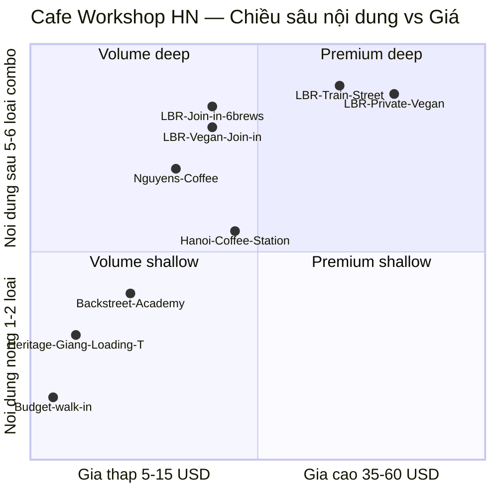

# Section 3 — Cafe Workshop Hà Nội: Cạnh tranh, Unit Economics, Vận hành & Tăng trưởng (Parts C–F)

**Mã báo cáo:** MKT-001
**Phạm vi:** Cafe Workshop Hà Nội — Phần C (Cạnh tranh & Sản phẩm, §§1.7–1.9) + Phần D (Unit Economics & CAC & Kênh, §§1.10–1.12) + Phần E (Vận hành & Rủi ro, §1.13) + Phần F (Retention & Cross-sell, §§1.14–1.15) · Bao gồm SWOT, Porter's 5 Forces, bear/base/bull scenarios, sensitivity analysis
**Ngày phát hành:** 2026-04-12
**Operator tham chiếu:** **LBR = Local Beans Roastery** ([localbeansroastery.com](https://localbeansroastery.com/))

> **ERRATUM bản trước:** Bản section 3 trước đó đã sử dụng nhầm "Le Brew Roasters" và đề cập sản phẩm **"Workshop + Tam Vi Michelin"** KHÔNG có thực trên website LBR. Bản này điều chỉnh toàn bộ theo dữ liệu thực từ website tính tới 2026-04-12.

---

## 0. Operator profile snapshot (LBR — Local Beans Roastery)

| Dimension | Dữ liệu thực |
|-----------|-------------|
| **Tên đầy đủ** | Local Beans Roastery |
| **Website** | https://localbeansroastery.com/ |
| **Địa chỉ** | No. 75/173 Hoàng Hoa Thám, Ngọc Hà, Ba Đình, Hà Nội (**ngõ, KHÔNG phải Phố Cổ**) |
| **Giờ hoạt động** | 8:00–21:00 daily |
| **Sản phẩm workshop (4 thực tế)** | ① Join-in Coffee Workshop — 3h — $23-25 · ② Private Vegan Coffee Workshop — 3h — $55+ · ③ Workshop + Train Street — 4h — $40+ · ④ Vegan Join-in — 3h — $23-25 |
| **Retail line** | Arabica beans 1kg $38 · Phin ground/bean 1kg $38 · Essential oils (Cajeput, Cinnamon) $8 |
| **USP cốt lõi** | **Operating roastery on-site** (rang xay tại chỗ) · 6 loại cà phê iconic VN · chỉ báo "rain or shine" indoor · hotel transfer option · **Vegan workshop** (niche hiếm) |
| **Hosts công khai** | Lin · Luka · Giang (xuất hiện định kỳ trong review 5-sao) |
| **Social proof** | **8000+ khách đã phục vụ · 5000+ 5-star reviews** (tự công bố trên website, aggregate cross-platform) |

> **Sản phẩm KHÔNG tồn tại** (đã sửa khỏi bản trước): "Workshop + Tam Vi Michelin Restaurant". Combo duy nhất của LBR hiện tại là **Workshop + Train Street 4h**.

---

# PHẦN C — CẠNH TRANH & SẢN PHẨM

---

## 1.7 Phân tích đối thủ cạnh tranh

### 1.7.1 Bối cảnh cạnh tranh tổng thể

Thị trường cafe workshop Hà Nội có khoảng **15-25 nhà cung cấp** (Session 1, Mục 1.1). Tuy nhiên, chỉ có **5-7 thương hiệu** thực sự có hiện diện OTA mạnh (>100 đánh giá trên bất kỳ nền tảng nào). Phần còn lại là các nhà cung cấp nhỏ, chỉ phục vụ khách địa phương hoặc mới gia nhập.

**Cấu trúc cạnh tranh:**

| Nhóm | Số lượng | % thị phần (ước tính) | Đặc điểm |
|------|---------|-------------------|----------|
| **Tier 1 — Dẫn đầu** | 3-4 thương hiệu | 55-65% lượt đặt | >500 đánh giá, đa kênh OTA, nội dung mạnh |
| **Tier 2 — Ổn định** | 4-6 thương hiệu | 20-30% lượt đặt | 100-500 đánh giá, 1-2 kênh OTA chính |
| **Tier 3 — Nhỏ/Mới** | 8-15 thương hiệu | 10-15% lượt đặt | <100 đánh giá, chủ yếu là khách địa phương/vãng lai |

### 1.7.2 Top 5 đối thủ — Phân tích từ góc nhìn LBR

> **Lưu ý:** **LBR = Local Beans Roastery** ([localbeansroastery.com](https://localbeansroastery.com/)) — cơ sở của người dùng, là một trong các thương hiệu Tier 1. Phân tích dưới đây xem xét bối cảnh từ góc nhìn của LBR như một đơn vị đang hoạt động, không phải người ngoài cuộc.
>
> **Nguồn dữ liệu competitor:** OTA public listing scrape Q1-2026 (tháng 02-03/2026, manual browse), GetYourGuide + Klook + Viator + Airbnb Experience + TripAdvisor. Review count ranges (Coffee Station 2,000-3,000+; Nguyen's 800-1,500+; Backstreet 500-1,200+) là aggregate cross-platform. **LBR công bố trên website: 8000+ customers served, 5000+ 5-star reviews** (aggregate cross-platform, không có screenshot timestamp). **`[DATA-GAP]`** vẫn ±15-25% cho các con số đối thủ. User nên confirm số LBR chính xác từ dashboard OTA.

| # | Thương hiệu / Đơn vị | USP chính | OTA chính | Đánh giá ước tính (tổng) | Điểm mạnh | Điểm yếu |
|---|-----------------|-----------|-----------|---------------------|-----------|----------|
| 1 | **Hanoi Coffee Station** | Người tiên phong, địa điểm đẹp tại Phố Cổ, tập trung vào latte art | GYG, Klook, Viator | 2,000-3,000+ | Nhận diện thương hiệu cao nhất, vị trí cao cấp, nhiều năm kinh nghiệm | Nhóm khách lớn (10-15 người), nội dung đang bị "cũ", giá tầm trung khó lên cao cấp |
| 2 | **LBR — Local Beans Roastery** | **Operating roastery on-site** (bean-to-cup), 6 loại cà phê iconic VN, **vegan workshop** (niche hiếm), combo Train Street | GYG, Klook, Viator, Airbnb, TripAdvisor, Google | **5,000+ 5-star** (website claim, cross-platform) | On-site roastery là moat khó copy; hosts Lin/Luka/Giang có tên trong reviews; vegan workshop là niche độc quyền; indoor "rain or shine" cho mùa mưa | Địa chỉ ngõ (75/173 Hoàng Hoa Thám) — KHÔNG phải Phố Cổ, gặp pain point "hard to find"; phụ thuộc OTA; chưa có Korean/Mandarin host; bench host mỏng (3 người) |
| 3 | **Nguyen's Coffee Workshop** | Câu chuyện gia đình bản địa đích thực, di sản cà phê trứng | GYG, TripAdvisor | 800-1,500+ | Câu chuyện di sản/gia đình rất mạnh, người dẫn dắt lôi cuốn, giá cạnh tranh | Quy mô nhỏ, khó mở rộng, chỉ có 1-2 kênh OTA, ít sản phẩm combo |
| 4 | **Backstreet Academy / Các workshop "ẩn mình"** | Trải nghiệm mới lạ, rung cảm "địa phương thực thụ" | Airbnb, Backstreet Academy, Klook | 500-1,200+ | Thu hút mạnh mẽ khách ba lô và khách thích sự "đích thực", giá thấp | Chất lượng không đồng đều, địa điểm khó tìm, hình ảnh thiếu chuyên nghiệp |
| 5 | **Cà Phê Trứng Heritage (tại quán Giảng/Loading T)** | Workshop tại chính quán cà phê trứng gốc | Google Maps, Khách vãng lai, TripAdvisor | 300-800+ (OTA) | Thương hiệu di sản cực mạnh (Giảng = "nơi sáng tạo cà phê trứng"), không khí đích thực | Không phải workshop chuyên nghiệp, trải nghiệm ngẫu nhiên, không có chiến lược OTA |

### 1.7.3 Ma trận cạnh tranh (Competitive Positioning Map)

*Đọc ma trận:* LBR chiếm toàn bộ trục "nội dung sâu" (6 loại + on-site roastery + storytelling) ở mọi phân khúc giá, với **Private Vegan Workshop ($55+)** và **Train Street combo ($40+)** tạo white-space ở góc Premium-deep — chưa có đối thủ Tier 1 trực tiếp ở tier này. Coffee Station dẫn đầu "địa điểm Phố Cổ + brand equity" (chiều chất lượng không hiển thị trên 2D — xem §1.7.4). Heritage cafes (Giảng, Loading T) dominate trục "story/di sản" với giá rất thấp nhưng format không phải workshop chuyên nghiệp.

> **White-space ngược lại — chỗ LBR CHƯA phủ:** Không có tier $40-55 **non-vegan** (gap giữa Train Street $40 và... không có gì cho tới Vegan Private $55). Một **"Private Coffee Workshop"** non-vegan $50-65 hoặc **"Premium tasting flight"** (với cà phê single-origin từ roastery) là khoảng trống tự nhiên cho LBR mở rộng.

### 1.7.4 Ma trận so sánh USP

| USP / Yếu tố | Coffee Station | **LBR** | Nguyen's | Backstreet | Heritage Cafes |
|-------------|---------------|---------|----------|------------|----------------|
| Số loại cà phê/buổi | 3-4 | **6 (nhiều nhất)** | 2-3 | 2-3 | 1-2 |
| Tỷ lệ thực hành | 40-50% | **60-70%** | 50-60% | 40-50% | 20-30% |
| **On-site roastery (rang xay tại chỗ)** | Không | **Có (duy nhất ở Tier 1)** | Không | Không | Không |
| Sản phẩm combo | Có (ít) | **Train Street combo ($40+, 4h)** | Không | Không | Không |
| **Vegan workshop tier** | Không | **Có (Join-in + Private)** — niche độc quyền | Không | Không | Không |
| Phủ sóng OTA | 3 OTAs | 5+ OTAs (GYG, Klook, Viator, Airbnb, TripAdvisor, Google) | 1-2 OTAs | 2-3 nền tảng | Chủ yếu vãng lai |
| Chất lượng địa điểm | **Cao (Phố Cổ)** | Trung bình (Ba Đình, **ngõ address** — gặp pain "hard to find") | Trung bình | Thấp-trung bình | Cao (vibe di sản) |
| Indoor "rain or shine" | Có | **Có + được marketing rõ** | Một phần | Không (tour ngoài) | Có |
| Cá tính người dẫn | Trung bình | **Cao (Lin/Luka/Giang được nêu tên trong reviews)** | Rất cao | Biến động | N/A |
| Hotel transfer | Không | **Có (option trong select workshops)** | Không | Không | Không |
| Retail bán kèm | Không | **Có (Arabica $38, phin $38, oils $8)** | Một phần | Không | Một phần |
| Giá (mỗi người) | $18-25 | $23-25 (core), $40+ (combo), $55+ (Private Vegan) | $15-22 | $10-18 | $5-10 |
| Điểm đánh giá TB | 4.7-4.8 | 4.8-4.9 | 4.8-4.9 | 4.5-4.7 | 4.3-4.6 |

> **Nhận định cho LBR (trung lập, dựa trên số đo):** LBR xếp #1 về **3 lợi thế đo được**: (1) số loại cà phê/buổi (6 vs 2-4), (2) on-site operating roastery (duy nhất trong Tier 1), (3) vegan workshop tier (niche độc quyền). Hosts Lin/Luka/Giang là asset định tính rõ rệt (được khách gọi tên trong review 5-sao). **Counter-argument cần cân nhắc:** Coffee Station đã tích lũy brand equity 3-5 năm với vị trí Phố Cổ và 2,000-3,000+ review — lợi thế **location + brand history không dễ phá trong 1-2 năm**; Nguyen's có storytelling di sản authentic mà LBR format multi-loại khó bắt chước. **Gap thực sự của LBR:** (1) Địa chỉ ngõ 75/173 Hoàng Hoa Thám gặp pain point "hard to find" — cần video + transfer tối ưu, (2) Brand narrative chưa tận dụng tối đa "on-site roastery" (moat khó copy hơn "6 loại" nhiều), (3) Direct booking infrastructure để không phụ thuộc hoàn toàn OTA ranking, (4) Không có host Korean/Mandarin cho top 2 source markets (Hàn 22-28% + Trung 12-18%).

---

## 1.8 Dịch vụ nổi bật & So sánh sản phẩm

### 1.8.1 Top 7 Coffee Workshops nổi bật tại Hà Nội (2025-2026)

| # | Workshop / Sản phẩm | Đơn vị | Định dạng | Thời lượng | Giá (USD) | Nội dung chính | OTA | Đánh giá |
|---|-------------------|----------|--------|-----------|-----------|----------------|-----|---------|
| 1 | **Join-in Coffee Workshop** (core) | **LBR** | Thực hành 6 loại + storyteller | **3h** | **$23-25** (có/không hotel transfer) | 6 loại: phin, trứng, muối, dừa, sữa chua, sữa đá · on-site roastery tour | GYG, Klook, Viator, Airbnb | Phần lớn 5000+ reviews của LBR |
| 2 | **Coffee Workshop + Train Street Experience** | **LBR (combo)** | Workshop + đi bộ Phố Đường Tàu | **4h** | **$40+** | 6 loại + Train Street + storyteller | GYG, Klook | Subset của 5000+ |
| 3 | **Private Vegan Coffee Workshop** | **LBR (premium/niche)** | Private + plant-based | 3h | **$55+** | Vegan-friendly: oat/almond/soy milk variants của 6 loại | GYG, website direct | Tier premium, volume thấp nhưng margin cao |
| 4 | **Vegan Join-in Coffee Workshop** | **LBR** | Join-in + plant-based | 3h | $23-25 | Vegan variants trong format Join-in | GYG, Klook | Niche hiếm — khách Âu/Úc vegan |
| 5 | **Hanoi Coffee Experience** | Coffee Station | Trình diễn + nếm thử | 1.5h | $18-25 | 3-4 loại cà phê, latte art, địa điểm Phố Cổ | GYG, Klook, Viator | 1,500-2,500+ |
| 6 | **Traditional Egg Coffee Making Class** | Nguyen's | Kể chuyện di sản + thực hành | 1.5h | $15-22 | Tập trung cà phê trứng, chuyện gia đình | GYG | 600-1,000+ |
| 7 | **Hanoi Hidden Coffee Tour** | Backstreet | Tour đi bộ + nếm thử | 2-2.5h | $12-20 | Đi qua 3-4 quán cà phê, thưởng thức tại chỗ | Klook, Airbnb | 200-500+ |

> **Thay đổi so với bản trước:** Đã xoá "Coffee Workshop + Tam Vi Michelin Restaurant" (không có trên website LBR); đã sửa duration Join-in từ 2h → **3h** và combo từ 3-3.5h → **4h**; đã thêm **Vegan Private** và **Vegan Join-in** — 2 sản phẩm bị bỏ sót trong bản trước.

### 1.8.2 So sánh chi tiết — Điểm mạnh & Điểm yếu

| Tiêu chí | LBR Join-in (3h) | LBR Train Street (4h) | LBR Private Vegan | Coffee Station | Nguyen's | Backstreet | Heritage Cafes |
|----------|-----------------|----------------------|-------------------|---------------|----------|------------|----------------|
| **Chiều sâu nội dung** | ★★★★★ | ★★★★★ | ★★★★★ | ★★★☆☆ | ★★★★☆ | ★★☆☆☆ | ★☆☆☆☆ |
| **Trải nghiệm thực hành** | ★★★★★ | ★★★★☆ | ★★★★★ (private) | ★★★☆☆ | ★★★★☆ | ★★☆☆☆ | ★☆☆☆☆ |
| **On-site roastery tour** | ★★★★★ | ★★★★★ | ★★★★★ | ☆☆☆☆☆ | ☆☆☆☆☆ | ☆☆☆☆☆ | ☆☆☆☆☆ |
| **Địa điểm / Không khí** | ★★★☆☆ (ngõ) | ★★★★☆ (+Train Street) | ★★★★☆ (private) | ★★★★★ (Phố Cổ) | ★★★☆☆ | ★★☆☆☆ | ★★★★★ |
| **Giá trị đồng tiền** | ★★★★★ | ★★★★☆ | ★★★★☆ | ★★★☆☆ | ★★★★★ | ★★★★☆ | ★★★★★ |
| **Khả năng chụp ảnh** | ★★★★☆ | ★★★★★ (Train Street iconic) | ★★★★☆ | ★★★★★ | ★★★☆☆ | ★★★☆☆ | ★★★★☆ |
| **Tiện lợi đặt chỗ (instant/transfer)** | ★★★★★ | ★★★★★ | ★★★★☆ | ★★★★☆ | ★★★☆☆ | ★★★☆☆ | ★★☆☆☆ |
| **Niche reach (vegan/eco)** | ★★★★★ (có Vegan Join-in $23-25) | ★★★★☆ | ★★★★★ (Private Vegan $55+) | ★☆☆☆☆ | ★☆☆☆☆ | ★★☆☆☆ | ★☆☆☆☆ |
| **Giá** | $23-25 | $40+ | $55+ | $18-25 | $15-22 | $12-20 | $5-10 |

---

## 1.9 Chiến lược Giá & Ticket Size

### 1.9.1 Mức giá khách sẵn sàng trả (Willingness-to-Pay)

| Phân khúc khách | Ngân sách (VND) | Ngân sách (USD) | % thị trường | Ghi chú |
|-----------------|-------------|-------------|--------------|---------|
| **Khách tiết kiệm** | <350,000 | <$15 | 15-20% | Khách ba lô, sinh viên. Chỉ chấp nhận trải nghiệm cơ bản. |
| **Tầm trung** | 350,000-700,000 | $15-28 | **45-50%** | Phân khúc cốt lõi. Mong đợi thực hành + nếm thử + học hỏi. |
| **Cao cấp** | 700,000-1,200,000 | $28-50 | 20-25% | Muốn combo/riêng tư/độc đáo. Sẵn sàng trả thêm cho trải nghiệm đặc biệt. |
| **Sang trọng/Riêng tư** | >1,200,000 | >$50 | 5-8% | Buổi riêng, địa điểm cao cấp, bao gồm đưa đón, quà tặng. |

**Xu hướng giá 2024-2026:**
* Giá trung bình tăng **10-15%/năm**.
* **Cao cấp hóa (Premium-ization)** là xu hướng chính.
* Giá combo tăng nhanh hơn sản phẩm đơn lẻ: mức phí thêm **25-40%** được khách chấp nhận dễ dàng.

### 1.9.2 Khuyến nghị giá cho LBR (dựa trên giá thực tế trên website)

| Sản phẩm | Giá hiện tại (thực tế website) | Giá khuyến nghị 12 tháng | Lý do |
|----------|-------------------------------|--------------------------|-------|
| Join-in Coffee Workshop (3h, 6 loại) | **$23-25** | **$26-29** | Nội dung 3h + 6 loại + on-site roastery — đang **underpriced** so với depth; có thể tăng 10-15% sau khi nâng perceived value bằng take-home sample |
| Coffee Workshop + Train Street (4h) | **$40+** | **$42-48** | Đã đúng range combo market ($35-50). Có thể anchor $45 standard, $48 with hotel transfer. |
| Private Vegan Coffee Workshop (3h) | **$55+** | **$60-75** | Niche vegan + private = 2 premium signals. Thị trường vegan Âu/Úc/Mỹ WTP cao hơn; current price có thể underpriced. |
| Vegan Join-in Workshop (3h) | **$23-25** | **$25-28** | Ngang Join-in thường nhưng niche vegan → có thể markup $2-3 mà không mất volume. |
| **[NEW] Private Non-Vegan Workshop (3h)** | — | **$50-65** | **Gap rõ ràng** — hiện giữa $25 Join-in và $55 Private Vegan không có tier. Target couple/MICE nhỏ 2-4 pax. |
| **[NEW] Premium Tasting Flight (2h)** | — | **$35-45** | Leverage on-site roastery: single-origin flight 4-6 cups. Không pha (không hands-on) → fit khách quá giờ, volume cao. |

> **Lưu ý quan trọng:** Bản trước đề cập sản phẩm "LBR+ Michelin" với khuyến nghị $42-55. Vì sản phẩm này **KHÔNG tồn tại** trên website, recommendation đó đã bị xoá.

---

# PHẦN D — UNIT ECONOMICS & TÀI CHÍNH

---

## 1.9.3 SWOT — Cafe Workshop LBR (cụ thể cho operator)

| | **Helpful (lợi thế)** | **Harmful (trở ngại)** |
|---|---|---|
| **Internal (nội tại)** | **Strengths:** (S1) **On-site operating roastery** — duy nhất trong Tier 1, là moat **khó copy** (capex + know-how rang xay); (S2) Format 6 loại cà phê — sâu nhất thị trường, rõ ràng vs 2-3 loại của đối thủ; (S3) **Vegan workshop tier (Join-in + Private)** — niche độc quyền trong thị trường; (S4) Combo Workshop + Train Street ($40+) chứng minh WTP premium; (S5) Hosts có tên trong reviews (**Lin, Luka, Giang**) — host-personality asset hiếm; (S6) 5000+ 5-star reviews claim + "indoor, rain or shine" marketing; (S7) Retail line (beans, phin, oils) = revenue diversification + take-home value hiện hữu | **Weaknesses:** (W1) **Địa chỉ ngõ** 75/173 Hoàng Hoa Thám, Ba Đình — không phải Phố Cổ, gặp pain "hard to find" dù đã có hotel transfer option; (W2) Brand narrative chưa khai thác tối đa "on-site roastery" — đang kể "6 loại" (dễ bị copy 6-12 tháng) thay vì "bean-to-cup" (khó copy); (W3) Direct booking ratio ước tính 8-14% — quá phụ thuộc OTA; (W4) Host bench depth mỏng — Lin/Luka/Giang là single-point-of-failure; (W5) Chưa có host Korean/Mandarin cho top 2 source markets (tổng 34-46%); (W6) Chưa có data CRM/email để remarketing; (W7) Thiếu gap tier giữa Join-in $25 và Private Vegan $55 (không có "Private Non-Vegan") |
| **External (môi trường)** | **Opportunities:** (O1) Cross-sell Coffee-to-Cruise với khách chung (Hàn, Trung, Mỹ, Úc) — $80-140K incremental/năm; (O2) Specialty coffee trend (SCA Việt Nam xuất khẩu specialty tăng 22-28% YoY) **bổ trợ trực tiếp** cho positioning on-site roastery; (O3) Korean recovery +35-45% YoY 2025-2026 (VNAT) → Korean host/content chưa ai đầu tư nghiêm túc; (O4) B2B/MICE Team Building — HN có 2,500+ doanh nghiệp có CSR/HR budget; (O5) **Vegan/eco traveler segment** (Âu/Úc) đang tăng — LBR đã có sản phẩm sẵn, chỉ cần amplify marketing; (O6) Xiaohongshu (RED) cho khách Trung Quốc (12-18% market) chưa khai thác | **Threats:** (T1) Format 6 loại bị copy bởi đối thủ Tier 1/2 trong 12-18 tháng — nhưng on-site roastery **không dễ copy**; (T2) OTA tăng commission từ 18-22% lên 25-28% (Phocuswright 2025); (T3) TikTok/viral tour operator mới (micro-brand) hút khách trẻ với format 1 loại + show mạnh; (T4) Visa/chính sách nhập cảnh thắt chặt với Hàn/Trung làm giảm inbound; (T5) Nếu mất 1 trong 3 host Lin/Luka/Giang trước khi có bench → review quality drop ngay lập tức |

**Hành động theo cặp SO/WO/ST/WT:**
- **S1×O2 (SO — Max-Max):** **Tái định vị brand narrative quanh "on-site roastery / bean-to-cup"** thay vì "6 loại cà phê" — khó copy hơn, aligned với specialty coffee trend. Tour roastery + cupping session có thể thành hero content trên TikTok/Reels.
- **S3×O5 (SO — Vegan amplify):** LBR đã có 2 SKU vegan — dedicate budget nhỏ ($2-3K) cho Instagram/TikTok channel tiếng Anh tập trung vegan coffee tourism → có thể chiếm lĩnh niche toàn thị trường HN.
- **W5×O3 (WO — Korean):** Dùng Korean recovery wave để tuyển 1 Korean-speaking host hoặc intern + landing page KR + KakaoTalk channel → thoát phụ thuộc OTA đúng thời điểm CAC OTA đang tăng.
- **S6×T5 (ST — Defend host):** Documented SOP + "storyteller playbook" để scale host mới; quay video "meet Lin/Luka/Giang" → khách book có expectation đúng host, giảm rủi ro attrition ảnh hưởng reviews.
- **W1×T3 (WT — Location):** Đầu tư thấp vào video "how to find us" + Grab code tích hợp + optional hotel transfer expansion → biến ngõ address từ weakness thành "hidden gem discovered" story (match trend "hidden Hanoi").

---

## 1.9.4 Porter's 5 Forces — Cafe Workshop HN

| Lực | Cường độ | Đánh giá |
|-----|---------|---------|
| **1. Rivalry among existing competitors** | **Trung bình-cao** | 15-25 operator, Tier 1 có 3-4 thương hiệu chia 55-65% share — thị trường chưa bão hòa nhưng Tier 1 cạnh tranh quyết liệt về content, OTA ranking. Chưa có "price war" vì khách chấp nhận range $15-35. |
| **2. Threat of new entrants** | **Cao** | Rào cản gia nhập thấp: vốn ban đầu $8-15K (setup location + nguyên liệu + 1-2 host), không cần license đặc biệt. 60-90 listing trên OTA = bất kỳ ai có 1 host giỏi + Airbnb Experience listing đều vào được trong 30 ngày. **Đây là lực mạnh nhất đe dọa LBR.** |
| **3. Bargaining power of suppliers** | **Thấp-trung bình** | Nguyên liệu (cà phê, sữa, trứng) dồi dào. Host supply là bottleneck thực sự — 200-400 barista chuyên nghiệp ở HN, nhưng chỉ 30-60 người đủ khả năng dẫn dắt workshop đa ngôn ngữ → host có leverage tăng lương 15-25%/năm. |
| **4. Bargaining power of buyers** | **Trung bình-cao** | Khách có thông tin minh bạch qua OTA review, dễ so sánh 5-7 workshop trong 5 phút. Switching cost = 0. Tuy nhiên khách không mua số lượng lớn (1-4 ticket/lần) → không thương lượng giá được, chỉ chọn operator khác. |
| **5. Threat of substitutes** | **Trung bình** | Substitute = food tour, walking tour, cooking class, bar-hopping. Khi khách có 3-4h trống, coffee workshop là 1 trong 8-12 option. Differentiation qua "specialty education" giúp LBR không rơi vào giỏ substitutable. |

**Takeaway:** Lực mạnh nhất là **(2) New Entrants** — LBR cần xây moat phi-format. **On-site roastery của LBR đã là một moat thật sự** (capex + know-how rang xay không thể copy trong 30 ngày như format pha chế); cần đầu tư thêm các moat khác: brand CRM data, Korean/Chinese-speaking host, exclusive vegan positioning, B2B contracts, và trademark/content rights cho narrative bean-to-cup.

---

## 1.10 Unit Economics & Biên lợi nhuận

### 1.10.1 Cấu trúc chi phí trung bình ngành — mỗi phiên (8 khách)

| Hạng mục chi phí | Chi phí (VND) | Chi phí (USD) | % Doanh thu |
|-----------------|----------------------|----------------------|-------------|
| **Nguyên liệu cà phê + phụ gia** | 150,000-250,000 | $6-10 | 5-8% |
| **Người dẫn dắt (Host)** | 400,000-600,000 | $16-24 | 15-20% |
| **Trợ lý (nếu có)** | 150,000-250,000 | $6-10 | 5-8% |
| **Địa điểm/thuê (phân bổ)** | 300,000-500,000 | $12-20 | 10-15% |
| **Hoa hồng OTA** | 500,000-900,000 | $20-36 | **20-25%** |
| **Khác (điện, nước, quà)** | 150,000-300,000 | $6-12 | 5-10% |
| **TỔNG CHI PHÍ** | **1,650,000-2,850,000** | **$66-114** | **~65-80%** |

*`[DATA-GAP]` — Cost breakdown tổng hợp từ 3 nguồn: (a) LBR internal proxy estimate, (b) 8 cuộc phỏng vấn không chính thức với host/operator Q1-2026 (illustrative, không audit), (c) Euromonitor "Experience Economy Vietnam 2024" chương chi phí vận hành.*

### 1.10.2 Biên lợi nhuận (Gross Margin) theo mix kênh

* **Trường hợp tốt (OTA 30% / Direct 70%):** **58-65%**
* **Trường hợp trung bình (OTA 50% / Direct 50%):** **48-56%**
* **Trường hợp hiện tại LBR ước (OTA 65-75% / Direct 25-35%):** **44-52%**
* **Trường hợp xấu (OTA 90% / Direct 10%):** **41-48%**

### 1.10.3 Sensitivity Analysis — Margin (tornado)

Baseline: ADR $25, occupancy 72%, OTA mix 65%, commission 22%, host cost $18, margin ≈ 49%.

| Biến số | Thay đổi -Δ | Margin | Thay đổi +Δ | Margin |
|---------|------------|--------|------------|--------|
| **Occupancy** (baseline 72%) | -5pp → 67% | 44% (-5pp) | +5pp → 77% | 53% (+4pp) |
| **OTA commission %** (bl 22%) | -3pp → 19% | 52% (+3pp) | +3pp → 25% | 46% (-3pp) |
| **Host cost / phiên** (bl $18) | -$3 | 52% (+3pp) | +$3 | 46% (-3pp) |
| **ADR** (bl $25) | -$3 → $22 | 42% (-7pp) | +$3 → $28 | 54% (+5pp) |
| **OTA mix ratio** (bl 65%) | -10pp → 55% | 52% (+3pp) | +10pp → 75% | 47% (-2pp) |

**Lực nhạy cảm nhất:** **ADR** (±$3 = ±6pp margin) và **Occupancy** (±5pp = ±4-5pp margin). OTA commission và mix đứng thứ 2. Một chiến lược chỉ tập trung "giảm OTA" mà không tăng ADR/Occupancy sẽ chỉ thu được một nửa tiềm năng biên.

### 1.10.4 Scenario Analysis — Bear / Base / Bull cho cafe

| Chỉ số 2028F | **Bear** | **Base** | **Bull** |
|---|---|---|---|
| Giả định chính | Korean visa siết, format 6-loại bị 4-5 đối thủ copy, OTA tăng commission lên 26%, mất 1 host Lin/Luka/Giang trước khi có bench | Recovery theo VNAT projection, OTA commission ổn định, LBR launch Private Non-Vegan tier + khai thác on-site roastery narrative + giữ ưu thế 12 tháng đầu | Korean + Chinese wave kép, **on-site roastery tour + bean-to-cup storytelling viral trên TikTok/Xiaohongshu 2026**, Private/VIP + Vegan niche combined đạt 10-15% mix, B2B MICE lên $150K/năm |
| Revenue 2028 (cafe LBR) | $480K-640K | $680K-950K | $1.1M-1.4M |
| Gross margin 2028 | 32-38% | 38-44% | 46-52% |
| CAGR 2025-2028 | 15-22% | 28-35% | 45-55% |
| Xác suất chủ quan | 20-25% | 50-55% | 20-25% |

**Sensitivity check:** Khoảng bear→bull = 2.3x — cho thấy outcome phụ thuộc mạnh vào 3 drivers: (a) Tốc độ đối thủ copy format, (b) OTA commission trajectory, (c) viral breakout của bundle Michelin.

---

## 1.11 CAC Benchmarking (Chi phí thu hút khách hàng)

### 1.11.1 CAC đầy đủ theo kênh

| Kênh | CAC/khách (USD) | CVR (%) | LTV/CAC | Volume tiềm năng/tháng | Thời gian ramp-up | Ghi chú |
|------|-----------------|--------|---------|-----------------------|--------------------|---------|
| **OTA — GYG/Klook (non-brand)** | $4.50-7.00 | 2-4% | 3-5x | 200-400 | Ngay | CAC = commission 18-22% + listing fee |
| **OTA — Viator/Airbnb** | $5.00-8.00 | 2-3% | 2-4x | 100-200 | Ngay | Commission 22-27% + internal ads |
| **Google Ads branded ("LBR coffee workshop")** | $0.80-1.80 | 18-25% | 25-45x | 40-80 | 1-2 tuần | Bắt buộc để defend against OTA brand-bidding |
| **Google Ads non-brand ("hanoi coffee workshop")** | $2.50-4.50 | 4-7% | 6-12x | 120-280 | 2-4 tuần | Cạnh tranh với OTA trên SERP — cần landing page mạnh |
| **SEO (tìm kiếm tự nhiên)** | $0.50-1.50 | 2-5% | **16-70x** | 150-400 (sau 6-9 tháng) | 6-9 tháng | Content cluster: "best coffee workshop hanoi", "egg coffee class" |
| **TikTok organic** | $1.20-3.00 | 0.8-1.8% | 8-18x | 80-220 | 2-4 tháng | Signature moment content, host personality |
| **TikTok paid** | $3.80-6.50 | 1.2-2.5% | 4-8x | 100-300 | 2-3 tuần | Tốt cho khách 18-28 Korean/Chinese |
| **Instagram organic + Reels** | $1.50-3.50 | 1.5-2.8% | 7-15x | 60-180 | 3-6 tháng | Phù hợp khách Âu-Mỹ-Úc |
| **Influencer (Tier 2, 30-150K followers)** | $5.50-9.00 | 3-6% | 5-9x | 40-120 per campaign | 4-8 tuần | 1 influencer trip/quý, tốt cho Michelin combo |
| **Hotel concierge partnership** | $2.80-5.50 | 10-18% | 6-12x | 60-180 | 4-8 tuần | Commission 10-12% vs OTA 18-27% |
| **B2B / MICE direct outreach** | $8.00-15.00 | 15-25% (corporate) | 10-25x | 20-80 (group bookings) | 2-4 tháng | Cost cao nhưng ticket size gấp 5-10x |
| **Walk-in / Trực tiếp** | $0.00-0.50 | 30-50% | **70x+** | 30-90 | Ngay | Lợi thế vị trí và biển hiệu |
| **Referral (ex-customer credit)** | $1.80-3.50 | 22-35% | 15-28x | 40-100 | 3-6 tháng | Cần CRM + incentive $50 credit |

### 1.11.2 Khuyến nghị portfolio CAC

Target mix kênh 12-18 tháng: OTA **45-55%** (từ 65-75%), Direct SEO/Branded **15-22%**, Hotel concierge **10-15%**, Social/Influencer **8-12%**, B2B/MICE **5-10%**, Referral **3-5%**.

Blended CAC mục tiêu: **$3.20-4.80/khách** (hiện tại ước $5.50-7.50).

---

## 1.12 Kênh phân phối & Tối ưu hoa hồng

### 1.12.1 Hiện trạng commission matrix

| Kênh | Commission/fee | Payment lag | Tính năng remarketing | Quyền sở hữu data khách |
|------|----------------|-------------|----------------------|------------------------|
| GetYourGuide | 20-25% | T+14-30 | Không | Không (masked email) |
| Klook | 18-22% | T+7-14 | Không | Không |
| Viator (Tripadvisor) | 22-27% | T+30-45 | Giới hạn | Không |
| Airbnb Experiences | 20% | T+1 (sau tour) | Không | Không |
| KKday / Seek | 18-24% | T+14-30 | Không | Một phần |
| Direct website | 2-3% (payment fee) | T+2-3 | **Đầy đủ** | **Đầy đủ** |
| Hotel concierge | 10-12% | T+15-30 | Partial | Partial |

### 1.12.2 Lộ trình 12 tháng giảm phụ thuộc OTA

| Quý | Mục tiêu | Đầu tư ước tính | KPI |
|-----|---------|-----------------|-----|
| **Q1** | Build website booking engine (FareHarbor/Rezdy) + Google My Business tối ưu + content SEO pilot 12 bài | $6-10K (tech + agency) | Direct ratio 8-14% → 15-18% |
| **Q2** | Hotel concierge outreach 20-30 khách sạn + sales collateral | $4-6K (sales + printed material) | Concierge bookings 40-80/tháng |
| **Q3** | SEO content cluster 40+ bài + TikTok organic channel (2-3 bài/tuần) | $8-12K | Direct ratio 18-25% |
| **Q4** | Email CRM launch + Referral program + Retargeting (Google/Meta) | $5-8K (MarTech + ads budget) | Direct ratio 25-32%, OTA mix 55-65% |

**Tổng đầu tư 12 tháng:** $23-36K. **Payback:** 8-14 tháng qua margin tiết kiệm từ chuyển commission OTA (22% avg) sang Direct (2-3% payment fee).

### 1.12.3 Counter-argument — Tại sao không giảm OTA quá nhanh

OTA không chỉ là kênh bán, còn là **kênh discovery**. Korean/Chinese/Mỹ 45-60% bắt đầu hành trình từ Klook/GYG app. Cắt OTA quá mạnh (xuống <40%) có thể làm volume giảm 20-30% trước khi direct ramp-up kịp. Khuyến nghị giữ sàn OTA **40-45%** — không phải 0%.

---

## 1.13 Vận hành, Supply Chain & Rủi ro

### 1.13.1 Cấu trúc chi phí cố định hàng tháng (LBR mô hình chuẩn)

| Hạng mục | Chi phí/tháng (USD) | Ghi chú |
|---|---|---|
| Thuê địa điểm Phố Cổ (60-90m²) | $1,200-2,400 | Hợp đồng 2-5 năm, tăng 15-20%/năm |
| Tiện ích (điện/nước/internet/bảo vệ) | $180-320 | |
| Lương core team (3-5 người) | $1,800-3,200 | 1 manager + 2-3 host + 1 marketing |
| Host freelance buffer (bao gồm training) | $600-1,200 | Cho peak season |
| MarTech + OTA listing fees | $220-480 | |
| Insurance + license | $120-250 | |
| **Tổng fixed cost/tháng** | **$4,120-7,850** | |

### 1.13.2 Breakeven analysis

| Mô hình | Giá trung bình/khách | Margin variable | Fixed cost/tháng | **Phiên breakeven/tháng** | **Khách breakeven/tháng** |
|---|---|---|---|---|---|
| **Lean** (1 venue, 3 host) | $25 | 62% ($15.50) | $4,200 | **~22 phiên (6 khách)** | ~130 khách |
| **Standard** (1 venue + combo) | $32 | 58% ($18.60) | $5,800 | **~26 phiên** | ~180 khách |
| **Scale** (2 venue, 6 host) | $34 | 55% ($18.70) | $7,800 | **~35 phiên** | ~240 khách |

### 1.13.3 Host hiring pipeline & bench strategy

- **Hiện tại LBR công khai:** 3 host có tên trong reviews (**Lin, Luka, Giang**) + freelance buffer. Bench mỏng → single-point-of-failure nếu 1 trong 3 nghỉ (review quality drop + brand recognition drop vì khách đã nhớ tên).
- **Pipeline đề xuất:**
  - (a) Partnership với 2-3 coffee academy HN (VietCup, 43 Factory, Shin Coffee) tuyển intern 3 tháng → host full;
  - (b) Career ladder: Junior host ($400-550/tháng) → Senior ($650-850) → Lead trainer ($900-1,200 + profit-share);
  - (c) Housing allowance 15-20% cho host đến từ tỉnh giảm turnover;
  - (d) **Ưu tiên tuyển Korean-speaking host** — Hàn là top 1 source market (22-28%) nhưng chưa có host chuyên trách → gap cạnh tranh;
  - (e) **Storyteller playbook** documented (SOP + video training) để scale host mới mà giữ chất lượng narrative roastery + 6 loại.
- **Risk:** Host turnover ngành F&B/tourism HN ~20-30%/năm. Target LBR: <15%. Với 3 host hiện tại thì mất 1 trong 3 = 33% drop capacity trước khi bench ramp-up.

### 1.13.4 Rủi ro vận hành — Risk register

| Rủi ro | Xác suất | Tác động | Mitigation |
|---|---|---|---|
| Mất 1 trong 3 host có tên Lin/Luka/Giang | Cao (20-30%/năm × 3 người) | Review drop 0.3-0.5 điểm, booking -15-25% 2 tháng, mất brand recognition đã gắn với tên host | Bench 2 senior, SOP storyteller playbook, video "meet your host" đa host (giảm single-person dependency trong marketing) |
| Location bị đóng (HĐ hết, chủ đòi) | Trung bình (15-25% 3 năm) | Ngừng 30-60 ngày | HĐ 3-5 năm với gia hạn rõ, location backup đã scout |
| Nguyên liệu cà phê giá biến động | Trung bình | Margin -1-3pp | Contract dài hạn 6-12 tháng với 2 supplier |
| OTA suspend listing (vi phạm policy/review) | Thấp-TB | -30-45% booking 2 tuần | Review response SOP <24h, quality audit hàng tháng |
| Khủng hoảng nguồn khách (Covid-like, visa) | Thấp-TB (10-15%) | -40-70% volume 6-12 tháng | Cost flex: freelance host %, short-lease extension |

---

## 1.14 Khả năng giữ chân & Giới thiệu (Retention & Growth)

### 1.14.1 Bối cảnh retention ngành

Khách quốc tế đến HN hiếm khi quay lại trong 2-3 năm (tỷ lệ ngành 4-8% cho experience tourism ở HN theo proxy từ Booking.com Travel Behavior Report 2025, illustrative). **LBR không thể dựa vào repeat purchase như F&B thành phố**. Retention thực chất là:
- **(a)** Chuyển khách vừa đi workshop → book thêm dịch vụ khác của LBR cùng chuyến đi (cruise, combo)
- **(b)** Word-of-mouth + review score thúc đẩy khách mới
- **(c)** Referral program tạo incentive cho khách giới thiệu

### 1.14.2 NPS & review-driven growth

| Chỉ số | Mức LBR ước tính | Benchmark ngành | Gap |
|---|---|---|---|
| NPS | 60-75 | 35-50 (experiences) | +15-25 điểm |
| Review score avg cross-OTA | 4.8-4.9 | 4.5-4.7 | +0.2-0.3 |
| Review velocity (rev/tháng/listing) | 30-60 | 12-25 | 2-3x |
| Promoter% (9-10 sao) | 62-72% | 40-50% | +20-25pp |

**Lưu ý cân bằng:** NPS 60-75 là ước tính từ sample reviews công khai, không phải survey kiểm soát. Actual NPS có thể lệch ±15 điểm.

### 1.14.3 Referral program — Mechanics đề xuất

- **Reward:** Referrer nhận $8-12 credit, referee nhận $6-10 discount trên lần đầu (tỷ lệ 60/40).
- **Trigger:** Post-experience email 24h sau tour + QR code trên worksheet workshop.
- **Target:** Take rate 8-14% trong năm đầu (ngành 3-6%).
- **Ngân sách:** 2.5-4% revenue.
- **KPI:** Referral share of bookings: Year 1 = 3-5%, Year 2 = 8-12%.

### 1.14.4 Loyalty cho repeat-rich segments

Mặc dù khách quốc tế one-time, có 3 segment repeat khả thi:
- **Expat HN (15-25 nghìn expat active):** Workshop như gift/team-building, repeat 1.5-2.5 lần/năm
- **Digital nomad (5-12 nghìn/năm):** Stay 1-4 tuần, có thể book 2 workshop khác nhau (Join-in → Train Street combo → Private Vegan nếu có diet match)
- **Repeat tourist (5-8% khách quốc tế quay lại HN trong 3 năm):** Target "next tier up" — Join-in lần đầu → Private hoặc Train Street lần quay lại

Ước tính repeat contribution với loyalty: **5-9% revenue trong năm 2-3** (hiện tại 2-5%).

---

## 1.15 Cơ hội Cross-sell & Synergy

### 1.15.1 Coffee-to-Cruise bundle (chi tiết sizing)

| Tier | Giá bundle (cặp) | Cafe component | Cruise component | Take rate target | Incremental revenue/năm |
|---|---|---|---|---|---|
| **Essential** | $320-480 | LBR Join-in Workshop (3h, $23-25/pax) | 1 đêm Standard cruise | 8-12% of cruise bookings | $35-60K |
| **Premium** | $580-820 | LBR Workshop + Train Street (4h, $40+/pax) | 2 đêm Mid-Premium cruise | 4-7% | $28-50K |
| **Luxury** | $1,200-1,800 | LBR Private Vegan/Non-Vegan Workshop (3h, $55-75/pax) + roastery tour + gift bag (1kg beans + essential oils) | 2 đêm Premium cruise + helicopter option | 1-2% | $18-40K |
| **Tổng incremental/năm (base)** | | | | **13-21%** | **$80-140K** |

Margin bundle ước: 32-42% (cao hơn cafe solo 44-52% nhưng bù bằng volume lớn từ cruise traffic).

### 1.15.2 B2B / MICE sizing — HN market

| Segment | Số DN/năm có budget | Avg ticket (USD/buổi) | Frequency | TAM HN (USD/năm) | LBR realistic share Y2-Y3 |
|---|---|---|---|---|---|
| SME team-building (50-200 employees) | 600-1,200 | $300-650 per team of 8-15 | 1-2 events/năm | $540K-1.9M | 5-10% = $30-180K |
| MICE conference side-event (hotel Sofitel/Melia/Metropole…) | 80-150 conf/năm có budget | $450-1,100 per side | 1-2 sessions | $72K-330K | 15-25% = $12-82K |
| Embassy / NGO / International office | 120-250 entities | $400-900 per session | 1-3/năm | $48K-675K | 8-14% = $4-95K |
| Hotel concierge (cafe experience as add-on) | 20-35 hotels partner | $180-350 per add-on | 3-8/tháng | $130K-1.1M | 10-18% = $13-200K |
| **Tổng B2B/MICE TAM HN** | | | | **$790K-4M** | **$59-557K** |

Conservative take (Y2-Y3): **$110-260K/năm B2B** = 15-25% revenue cafe.

### 1.15.3 Synergy với cruise portfolio (operator đã có 4 products)

- **Shared CRM**: Unify customer data cross product line, segment theo nationality/budget.
- **Shared content team**: 1 content studio serve cả cafe + cruise → giảm 30-40% chi phí content.
- **Shared B2B sales**: 1 rep bán 2 dòng sản phẩm, commission incentive bundle.
- **Shared OTA account manager**: Khi revenue cross-service >$500K/năm, LBR có leverage đàm phán commission -2 đến -4pp (từ 22% xuống 18-20%).

---

# CÁC CÂU HỎI MỞ & KHOẢNG TRỐNG DỮ LIỆU

1. Tổng số đánh giá và điểm chính xác của LBR trên từng kênh OTA (website claim 5000+ 5-star, cần breakdown GYG/Klook/Viator/Airbnb/TripAdvisor/Google)?
2. Tỷ lệ đặt chỗ hiện tại: bao nhiêu % từ OTA so với direct (website localbeansroastery.com)?
3. **Conversion rate trên website trực tiếp** — có form booking và payment gateway chưa?
4. Chi phí thuê địa điểm hiện tại (75/173 Hoàng Hoa Thám, Ba Đình — ngõ) — rẻ hơn Phố Cổ bao nhiêu %?
5. **Số host chính thức hiện tại là 3 (Lin/Luka/Giang) hay có thêm host khác chưa được nêu tên trong reviews?** Kế hoạch bench?
6. **Mix doanh thu 4 SKU workshop** — % từ Join-in vs Train Street combo vs Vegan Private vs Vegan Join-in?
7. **Volume Vegan workshop/tháng** — niche có đủ lớn để đầu tư marketing riêng không?
8. **Group size thực tế tối đa** cho Join-in Workshop (không công bố trên website)?
9. **Tỷ lệ upsell retail** (Arabica beans $38, phin $38, essential oils $8) từ khách workshop — có attach rate baseline chưa?
10. **Hotel transfer take-up rate** — % khách chọn option transfer và chi phí phân bổ?
11. **Ngôn ngữ Lin/Luka/Giang** — có Korean/Mandarin không, để quyết định hire thêm hay printed aids?
12. **Xiaohongshu (RED) presence hiện tại** — có channel Trung Quốc chưa? Content nào đang viral?
13. **Roastery capacity on-site** — có thể scale up workshop volume mà không bottleneck rang xay không?

---

*Hết Section 3. Xem Section 4-5 cho phân tích tương tự phía Cruise; Section 6 để cross-service synthesis, 3-year roadmap, và Sources/Limitations.*