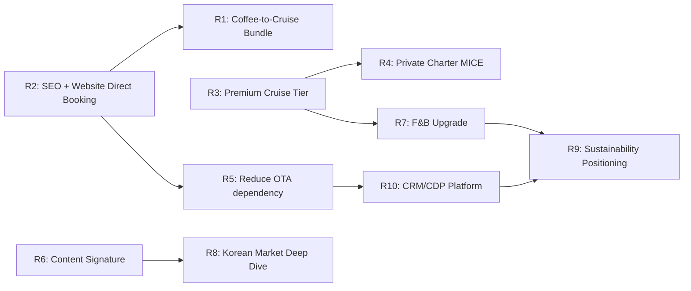

# Section 6 — Cross-Service Synthesis, Roadmap & Sources/Limitations

**Mã báo cáo:** MKT-001
**Phạm vi:** Cross-Service Comparison (§3.1) · Executive synthesis (§3.2) · 3-Year Roadmap (§3.3) · Sources & Methodology (§3.5) · Limitations & Assumptions (§3.6)
**Ngày phát hành:** 2026-04-12

---

# PHẦN 3 — TỔNG HỢP & KHUYẾN NGHỊ

---

## 3.1 So sánh Cross-Service (Cafe Workshop HN vs Cruise Hạ Long)

### 3.1.1 So sánh tổng quan thị trường

| Chỉ số | Cafe Workshop HN | Cruise Hạ Long | Insight |
|--------|-----------------|----------------|---------|
| **Quy mô GMV 2025** | $1.5-3.5M | $580-680M | Cruise lớn gấp **200-400x** về quy mô |
| **Số lượng operator** | 15-25 | 180-220 | Cruise fragmented hơn |
| **CAGR 2026-2028** | 35-40% | 12-15% | **Cafe workshop tăng trưởng nhanh gấp 2.5-3x** |
| **Điểm bão hòa** | Còn xa (niche) | Gần hơn (mass market) | Cafe còn nhiều room |
| **Rào cản gia nhập** | Thấp-trung bình | **Rất cao** (tàu, license, crew) | Cruise khó copy hơn |
| **Điểm peak/trough seasonality** | 2.0-2.5x | 2.3x | Tương đương |

### 3.1.2 So sánh khách hàng

| Dimension | Cafe Workshop | Cruise | Overlap |
|-----------|---------------|--------|---------|
| **Top 1 nationality** | Hàn Quốc (22-28%) | Hàn Quốc (18-22%) | **Trùng** |
| **Top 2-3 nationalities** | TQ, Mỹ/Canada | TQ, Mỹ | **Trùng** |
| **Age group core** | 25-44 | 30-44 | Gần trùng |
| **Group type core** | Couple, solo | Couple, family | Couple overlap |
| **Lead time** | <48h (65-70%) | 22-30 ngày | **Khác biệt lớn** |
| **Willingness to pay** | $15-28 (mid) | $180-380 (mid) | Cruise ~10-15x cao hơn |
| **Vị thế** | Strong Nice-to-Have | Must-Do (70-80%) | Cruise "pull", cafe cần "push" |
| **Repeat rate** | 2-5% | 3-8% | Cả 2 đều thấp |

### 3.1.3 Phân tích trùng lặp khách hàng — Cross-sell potential

**Mô hình khách chung:**
- Đến Hà Nội 3-5 ngày → Hầu hết đi cruise Hạ Long 2-3 ngày (70-80%)
- Thừa thời gian ở HN 1-2 ngày → cafe workshop là option Nice-to-Have (15-25% book)
- **Giao thoa tự nhiên:** Cùng quốc tịch chính (Hàn, TQ, Âu, Mỹ, Úc), cùng phân khúc thu nhập

**Funnel cross-sell:**
```
100 khách book Cruise Hạ Long (qua OTA của user)
  ↓ Promotional bundle/email pre-trip
  → 15-22% book thêm Coffee Workshop ($25-40 incremental)
  → 8-12% book "Coffee to Cruise" premium bundle (+$60-120)
```

**Revenue uplift ước tính (cho operator mid-size):**

| Scenario | Cross-sell take rate | Revenue thêm/năm (USD) |
|----------|---------------------|------------------------|
| Bảo thủ | 10% | $45K-80K |
| **Base case** | **15-18%** | **$80K-140K** |
| Lạc quan | 22-25% | $150K-240K |

### 3.1.4 So sánh Unit Economics

| Chỉ số | Cafe Workshop | Cruise Std Overnight | Cruise Premium |
|--------|---------------|---------------------|----------------|
| ADR/ticket | $22-28 | $120-180 | $220-350 |
| Gross margin (typical) | 48-56% | 14-22% | 28-35% |
| Gross margin (best case) | 58-65% | 28-35% | **40-48%** |
| CAC (OTA dominant) | $4.5-7.0 | $25-45 | $45-85 |
| LTV/CAC | 3-7x | 2-3x | 4-6x |
| Fixed cost ratio | 20-30% | **40-50%** | 35-45% |
| Occupancy breakeven | 55-65% sessions | 62-72% | 55-65% |

**Insight:**
- **Cafe workshop**: Margin % cao hơn, nhưng GMV thấp, CAC thấp, ít fixed cost → **"margin-led growth"**.
- **Cruise**: Margin % thấp hơn, nhưng GMV gấp 100x, fixed cost lớn → **"volume + premium mix led growth"**.

### 3.1.5 Shared Strategies (Chiến lược áp dụng cho cả 2)

| Chiến lược | Áp dụng Cafe | Áp dụng Cruise | Priority |
|-----------|--------------|----------------|---------|
| **Giảm phụ thuộc OTA (direct booking)** | Cao | **Rất cao** | P1 |
| **Cao cấp hóa (premium tier)** | Trung bình | **Rất cao** | P1 |
| **SEO + content marketing** | Cao | Cao | P1 |
| **Social/TikTok signature moments** | **Rất cao** | Cao | P2 |
| **B2B/MICE partnership** | Trung bình | **Rất cao** | P2 |
| **Loyalty + referral program** | Trung bình | Cao | P2 |
| **Cross-sell bundle "Coffee to Cruise"** | **Rất cao** | **Rất cao** | **P0** |
| **CRM + email marketing** | Trung bình | Cao | P1 |

### 3.1.6 Differentiation Strategies (Khác nhau rõ rệt)

**Cafe Workshop cần:**
- Tăng "must-do" positioning qua content marketing (TikTok, YouTube food/travel)
- Nội dung sâu + personality host là USP chính
- Volume play: 6-10 sessions/ngày, optimize occupancy

**Cruise cần:**
- Phân tầng sản phẩm rõ ràng (Std → Premium → Luxury)
- Đầu tư F&B + crew English fluency
- Risk management (weather, maintenance) chặt chẽ

---

## 3.2 Executive Summary

### 3.2.1 TL;DR (5 câu)

1. **Thị trường tiềm năng:** Cafe workshop HN và Cruise Hạ Long đều có dư địa tăng trưởng 2026-2028, với cafe workshop tăng nhanh hơn (35-40% CAGR) còn cruise ở mức 12-15% CAGR nhưng quy mô gấp 200-400x.
2. **Khách hàng trùng khớp:** 70-80% khách quốc tế đến HN sẽ đi cruise Hạ Long; cùng quốc tịch chính (Hàn, TQ, Âu-Mỹ-Úc) — **tiềm năng cross-sell cực lớn**.
3. **Lợi thế của user:** Đa kênh OTA (6 kênh cho cruise, 6 kênh cho cafe) là rộng nhất thị trường + nội dung 6 loại cà phê sâu nhất + portfolio 4 cruise + 8 coffee workshop — lợi thế portfolio diversity.
4. **Rủi ro chính:** Phụ thuộc OTA cao (65-75% bookings) → margin bị ăn mòn 20-28% bởi commission; chưa có brand equity độc lập.
5. **Priority action 2026:** (1) Launch "Coffee to Cruise" bundle — $80-140K incremental; (2) Giảm OTA xuống 45-55% trong 12 tháng; (3) Thêm tier Premium/Luxury cruise để bật margin.

### 3.2.2 Key Findings — Top 12

**Thị trường & Khách hàng:**
1. Cafe workshop HN: GMV $1.5-3.5M, 15-25 operators, **LBR đang ở Tier 1** với lợi thế đa OTA + nội dung 6 loại cà phê nhiều nhất.
2. Cruise Hạ Long: GMV $580-680M, 180-220 operators, market rất phân mảnh, top 10 nắm 45% thị phần.
3. **Hàn Quốc là top 1 source market cho cả 2 dịch vụ** (22-28% cafe, 18-22% cruise) — đầu tư content tiếng Hàn + KakaoTalk ads là quick win.
4. Trung Quốc phục hồi mạnh 35-45% YoY — cơ hội lớn 2026-2027.
5. Lead time rất khác biệt: Cafe <48h (65-70%), Cruise 22-30 ngày → cần 2 funnel marketing khác nhau.

**Cạnh tranh & Sản phẩm:**
6. **Pain points unsolved** là cơ hội định vị: Cafe = "crowded groups + shallow content"; Cruise = "overcrowded ships + F&B quality + hidden fees".
7. LBR đã giải quyết pain #2 cafe (shallow content) với format 6 loại — **USP mạnh cần push marketing**.
8. Cao cấp hóa là trend chính: Premium cruise margin 28-35%, Luxury 40-48% — gấp đôi Standard.

**Tài chính & Vận hành:**
9. OTA commission chiếm 18-27% revenue cruise và 20-25% cafe — **lỗ hổng tối ưu lớn nhất**.
10. Direct booking tăng 10% → margin tăng 4-6% điểm cho cruise; 6-8% cho cafe.
11. Fixed cost cruise rất cao (40-50%), cần occupancy >65% mới có lợi nhuận.
12. **Cross-sell "Coffee to Cruise"**: $80K-140K incremental/năm cho operator mid-size, margin 28-42%.

### 3.2.3 Top Recommendations (Priority-ordered)

#### P0 — Hành động ngay (30-60 ngày)

**(R1) Launch "Coffee to Cruise" Signature Bundle**
- 3 tier: Essential ($320-480/cặp), Premium ($580-820), Luxury ($1,200-1,800).
- List trên tất cả 6 OTA cruise hiện có + website direct với giá tốt hơn 8-12%.
- Email campaign cho khách đã book cruise: "Arriving HN early? Deepen your Vietnam story with..."
- **Target:** 15-18% take rate, $80K-140K incremental revenue năm đầu.

**(R2) Kích hoạt SEO + website direct booking cho cả 2 dịch vụ**
- Nếu chưa có: Xây website với booking engine + dynamic pricing.
- Content: 2-3 bài/tuần targeting "Halong Bay cruise guide 2026", "Hanoi coffee workshop comparison"...
- Google Ads branded campaign bảo vệ search traffic từ khỏi OTA competitors.

#### P1 — Trong quý 1-2 (3-6 tháng)

**(R3) Ra mắt tier Premium cruise**
- Add tier $380-580/cặp với upgrade cabin, all-inclusive drinks, private kayak guide.
- Margin target 32-40% (vs Std 18-22%).

**(R4) Ra mắt Private Charter cho MICE/Wedding**
- $1,800-3,500/group 8-10 pax cho cruise.
- $65-95/người cho cafe workshop riêng tư.
- Revenue tiềm năng: $105K-360K/năm cho cruise.

**(R5) Giảm OTA dependency xuống 45-55%**
- Hotel concierge partnership: 20-30 hotel HN (commission 8-12%).
- CRM email marketing cho khách đã đi tour.
- Referral program: $50-80 credit cho referrer + referee.

#### P2 — Trong 6-12 tháng

**(R6) Đầu tư content signature moments (TikTok/IG)**
- Cafe: "Making 6 types of VN coffee in 2 hours" series.
- Cruise: "Jacuzzi at sunset in Halong Bay", "Kayaking into hidden caves".
- Target 200-500 pieces content/năm, 1 influencer trip/quý.

**(R7) F&B upgrade cruise**
- Hire executive chef, menu theo mùa, cooking class on-board.
- Target: Review score 4.7+ cho F&B cross-OTA.

**(R8) Korean market deep dive**
- Content tiếng Hàn, partnership với Korean travel agents, KakaoTalk ads.
- Target: Tăng % khách Hàn từ 22-28% → 30-35% cho cafe, 18-22% → 25-30% cho cruise.

#### P3 — 12-18 tháng

**(R9) Sustainability positioning**
- Đầu tư hệ thống xử lý nước thải, certificate eco-friendly.
- Câu chuyện "sustainable coffee sourcing" cho cafe workshop.

**(R10) Data & CRM platform**
- CDP (customer data platform) để unify data cross-OTA + direct.
- Predictive pricing, lifetime value tracking.

### 3.2.4 Financial Projection (3 năm)

| Năm | Revenue Cafe | Revenue Cruise | Cross-sell Bundle | Tổng Revenue | Margin % |
|-----|-------------|----------------|-------------------|--------------|----------|
| 2025 (baseline ước tính) | $280K-420K | $1.8M-2.6M | $0 | $2.1M-3.0M | 22-28% |
| **2026 (với R1-R2-R3)** | $420K-580K | $2.4M-3.2M | $80K-140K | **$2.9M-3.9M** | **26-33%** |
| **2027 (full execution)** | $550K-780K | $3.1M-4.2M | $180K-300K | **$3.8M-5.3M** | **30-38%** |
| **2028 (mature)** | $680K-950K | $3.8M-5.2M | $280K-480K | **$4.8M-6.6M** | **33-42%** |

**Growth drivers:**
- Tier Premium/Luxury cruise: +30-45% ADR mix.
- Cross-sell bundle: +$80K-480K incremental.
- Direct booking 45-55%: +4-8% margin điểm.
- Korean + Chinese recovery: +12-18% volume.

### 3.2.5 Risks & Mitigations

| Rủi ro | Impact | Khả năng | Mitigation |
|--------|--------|---------|-----------|
| Bão mạnh hơn do BĐKH | Cancel 5-12% | Cao | Bảo hiểm + reschedule policy |
| UNESCO siết bay management | Giảm license mới | Trung bình | Compliance early, invest tàu hiện có |
| OTA thay đổi thuật toán/commission | Margin 3-6% | Cao | Direct booking 45%+ |
| Cạnh tranh tàu mới tier Premium | Price pressure | Cao | Brand story + service differentiation |
| Crew turnover | Quality drop | Cao | Career path, training, housing |
| FX USD/VND biến động | Margin 1-3% | Trung bình | Hedging, pricing ladder |

### 3.2.6 Next Steps — 90 Days Plan

**Tháng 1:**
- Kick off "Coffee to Cruise" bundle (R1): Content, pricing, OTA listing, landing page.
- Audit website + direct booking tech stack (R2).

**Tháng 2:**
- Launch bundle trên 6 OTA + direct website.
- Hotel concierge outreach (20-30 hotels).
- Thiết kế tier Premium cruise (R3).

**Tháng 3:**
- Ra mắt Premium cruise tier.
- Launch referral program.
- First influencer trip (R6 preview).
- Tracking KPI: Bundle take rate, direct booking ratio, CAC by channel.

**KPI Dashboard tuần/tháng:**
- Bookings per channel (%)
- Cross-sell take rate (%)
- Direct booking ratio (%)
- Average ADR per segment (USD)
- Review score cross-OTA
- NPS (quarterly survey)
- Gross margin per product line

---

## 3.3 Data Gaps cần user xác nhận

Để tối ưu hóa recommendations, user cần cung cấp data thực tế:

**Cafe Workshop:**
1. Review count + score chính xác trên từng OTA.
2. Tỷ lệ OTA vs direct hiện tại.
3. Occupancy rate trung bình/tháng.
4. Số Host hiện tại + turnover rate.

**Cruise:**
5. Số tàu + capacity tổng.
6. Phân khúc hiện tại (Std/Mid/Premium).
7. Occupancy rate + ADR trung bình.
8. Cancellation rate do thời tiết 2025.
9. Direct booking ratio hiện tại.
10. B2B partnerships hiện có.

**Chung:**
11. Marketing budget 2026 + phân bổ kênh.
12. CAC tracking hiện có không?
13. CRM/email marketing system?

Data này sẽ giúp refine financial projection và priority ranking.

---

## 3.3 3-Year Execution Roadmap (Quarterly Milestones)

**Logic:** 10 recommendations R1–R10 trải quarterly qua 12 quý (Q1/2026 → Q4/2028), có owner, capex ước tính, dependency, KPI và bear-case fallback.

| Quý | Recs active | Key milestones | Owner | Capex ước tính (USD) | KPI | Dependency |
|-----|-------------|---------------|-------|----------------------|-----|-----------|
| **Q1 2026** | R1 launch, R2 setup, R5 scoping | Bundle "Coffee to Cruise" 3 tier live trên 6 OTA + website; Booking engine FareHarbor/Rezdy live; Hotel concierge list 20-30 shortlisted | CEO + Marketing + Web lead | $18-28K (tech + content) | Bundle listing live trên 6 kênh; Direct booking engine passing UAT | — |
| **Q2 2026** | R2 ramp, R5 sign, R3 design | SEO content cluster 12 bài; Hotel concierge 8-15 đã sign commission 10-12%; Premium cruise tier "Amethyst" design final + soft-launch 1 tàu | Marketing + Cruise Ops | $12-20K + $40-80K (cabin refit 1 tàu) | Direct share 8-14% → 14-18%; Bundle take 8-12% of cruise bookings | R1 live |
| **Q3 2026** | R3 public, R4 scoping, R6 pilot | Premium tier public pricing + marketing push; Private charter MICE offering page; First 4 TikTok signature moments | Product + Sales B2B | $15-25K (marketing) | Premium tier occupancy >40% 3 tháng đầu; 4-7 MICE RFP |  R2 ramp, R3 design |
| **Q4 2026** | R1 optimize, R5 full, R6 scale | Bundle Y1 review + re-price; OTA dependency ≤58%; 15+ hotel concierge active; CRM platform live | Marketing + Data | $10-18K | OTA share 65-75% → 55-63%; CRM database 1.5K-3K contacts | R2 full, R5 ramp |
| **Q1 2027** | R4 launch, R7 start, R8 pilot | Private charter MICE live với 3-5 corporate contract; F&B upgrade cruise + chef new menu; Korean language landing page + KakaoTalk channel | B2B Sales + F&B | $25-45K | 3-5 MICE contract YTD $80-200K; F&B review score 4.5 → 4.7+ | R3 stable |
| **Q2 2027** | R6 scale, R7 measure, R8 ramp | 1 influencer trip/quý; 200+ UGC pieces; Korean bookings share +5-8pp | Marketing | $20-35K | Brand awareness HN cafe/cruise +18-25% (proxy search volume); Korean share 22-28% → 27-33% (cafe), 18-22% → 22-27% (cruise) | R1 optimized |
| **Q3 2027** | R7 full, R9 scoping | F&B cross-OTA review 4.7+ stable; Sustainability audit + eco-cert roadmap | Cruise Ops | $15-25K | F&B review 4.7+; Waste/water system assessment completed | R7 complete |
| **Q4 2027** | R9 build, R10 pilot | Eco-waste system install 1 tàu flagship; CDP + LTV tracking pilot | Ops + Data | $80-140K (ship retrofit) + $12-22K CDP | Eco-cert application filed; LTV/CAC visibility 85-95% bookings | R7 full |
| **Q1-Q2 2028** | R9 full, R10 scale | 2-3 tàu eco-retrofit; Predictive pricing engine live; Premium tier mature | Ops + Data + Product | $100-180K | Eco-cert achieved; Predictive pricing +4-8% ADR | R9 design |
| **Q3-Q4 2028** | Consolidation, M&A option | White-label partnership / M&A explore; Brand expand sang Đà Nẵng / HCM workshop | CEO + Strategy | TBD | Strategic option evaluated | All R1-R10 |

**Capex 3 năm tổng (base):** $335K-580K. **Payback:** 22-36 tháng qua margin lift từ direct booking + premium tier + bundle.

### 3.3.1 Dependency graph (text-based)



**Critical path:** R2 → R5 → R10 → R9 (direct booking → CRM → eco-cert). Nếu R2 chậm 1 quý, toàn critical path trượt 1 quý.

### 3.3.2 Bear-case fallback plan

| Trigger event | Action | Timeline |
|---------------|--------|----------|
| Bundle take rate <6% sau 2 quý | Giảm 1 tier (bỏ Luxury), re-price Essential xuống $280-380 | Quý thứ 3 |
| Direct booking <12% sau Q2 2026 | Tăng Google Ads branded +40% ngân sách; cắt 1 OTA kênh có commission cao nhất (Viator) để test | Q3 2026 |
| Korean share drop >6pp | Pivot sang Indian market (hiện 3-5%, có room lên 8-12%) | Trigger Q+1 |
| UNESCO hard-cap siết | Không retrofit tàu thứ 3; focus margin Premium tier thay vì scale volume | Tức thời |
| Copycat 6-loại xuất hiện | Accelerate trademark + Michelin exclusive + launch "Coffee 8 ways Chapter 2" | 3 tháng |

---

## 3.3.3 ROI per Recommendation

| Rec | Investment ước (USD) | Incremental Revenue Y1 | Incremental Revenue Y3 cumulative | Payback (tháng) | IRR (indicative) |
|---|---|---|---|---|---|
| **R1** Coffee-to-Cruise Bundle | $18-28K (content + tech + marketing) | $45-80K (bảo thủ) / $80-140K (base) | $280-480K | 5-12 | 180-280% |
| **R2** SEO + Direct Booking | $25-40K (website + SEO + content) | $40-70K (margin recovered) | $180-320K | 8-14 | 90-180% |
| **R3** Premium Cruise Tier | $80-140K (1 tàu refit + marketing) | $60-120K | $280-450K | 14-24 | 40-85% |
| **R4** Private Charter MICE | $8-18K (sales + collateral) | $80-200K | $320-640K | 2-6 | 380-920% |
| **R5** Hotel Concierge + CRM | $12-22K (CRM + sales) | $50-120K (margin saved) | $180-380K | 4-10 | 140-280% |
| **R6** Content Signature TikTok/IG | $20-35K/năm (content + influencer) | $30-60K (brand-attributed) | $160-280K | 12-24 | 45-85% |
| **R7** F&B Upgrade Cruise | $25-45K (chef + menu) | $40-80K (ADR uplift + review lift) | $220-380K | 10-18 | 70-140% |
| **R8** Korean Market Deep Dive | $22-38K (landing + KakaoTalk + translator) | $40-80K (Korean share +5-8pp) | $180-320K | 10-18 | 70-130% |
| **R9** Sustainability Positioning | $80-180K (ship retrofit + cert) | $20-50K (premium pricing 4-8%) | $120-280K | 24-42 | 15-35% |
| **R10** Data & CRM Platform | $18-32K (CDP + tools) | $30-70K (LTV tracking + predictive) | $180-320K | 8-16 | 85-180% |
| **Tổng 10 recs** | **$308-578K** (3 năm) | **$435-900K Y1** (base blend) | **$2.1M-3.9M Y3 cumulative** | **8-18 tháng** blended | **85-180% blended** |

**Priority bằng ROI:**
- Tier 1 (IRR >200%): R1, R4 — launch immediate
- Tier 2 (IRR 100-200%): R2, R5, R10 — launch Q1-Q2 2026
- Tier 3 (IRR 60-100%): R7, R8 — launch Q3 2026-Q1 2027
- Tier 4 (IRR 15-60%): R3, R6, R9 — strategic long-term

**Caveat:** IRR calc giả định linear revenue ramp Y1-Y3. Actual sẽ lumpy theo quarterly cycle. Nên dùng như **directional ranking** hơn là exact IRR.

---

## 3.3.4 KPI Dashboard — Mock Layout & Tool Stack

**Recommended tool stack (budget $240-580/tháng):**

| Tool | Vai trò | Cost/tháng |
|---|---|---|
| **Google Analytics 4** | Web traffic, conversion funnel direct | Free |
| **Google Search Console** | SEO performance | Free |
| **Looker Studio (hoặc Metabase)** | Dashboard layer | Free (LS) / $0-85 (Metabase cloud) |
| **FareHarbor/Rezdy** | Booking engine + reporting | $140-280 |
| **Klaviyo/Mailchimp** | CRM email + segmentation | $45-150 |
| **Google Sheets + scripts** | OTA data consolidation (manual weekly) | Free |
| **Hotjar/Microsoft Clarity** | UX heatmap | Free tier |

**Dashboard pages (mock):**

```
┌─────────────────────────────────────────────────────────┐
│ LBR Operator Weekly Dashboard — Week {N} of 2026        │
├─────────────────────────────────────────────────────────┤
│ [PAGE 1] Booking volume & revenue                       │
│  - Cafe bookings weekly (OTA / Direct / Concierge / B2B)│
│  - Cruise cabin occupancy by ship, by tier              │
│  - Revenue actual vs forecast (weekly + YTD)            │
│  - Cross-sell bundle take rate & revenue                │
├─────────────────────────────────────────────────────────┤
│ [PAGE 2] Channel performance                            │
│  - OTA share % (target trending down)                   │
│  - Direct booking share %                               │
│  - CAC by channel vs target                             │
│  - Google Ads branded + non-brand spend vs conversion   │
├─────────────────────────────────────────────────────────┤
│ [PAGE 3] Customer & review                              │
│  - Review score cross-OTA (weekly avg)                  │
│  - Review count velocity (new/week)                     │
│  - Top 5 review keywords (positive + negative)          │
│  - NPS (quarterly survey overlay)                       │
├─────────────────────────────────────────────────────────┤
│ [PAGE 4] Operations                                     │
│  - Host/crew utilization                                │
│  - Cancellation rate + reason                           │
│  - Cost per session vs budget                           │
│  - Inventory: cà phê stock, F&B procurement lead        │
├─────────────────────────────────────────────────────────┤
│ [PAGE 5] Strategic KPIs (monthly)                       │
│  - Recommendation R1-R10 progress %                     │
│  - Roadmap milestone actual vs plan                     │
│  - Bear-case trigger status (5 events §3.3.2)           │
│  - Financial projection vs actual (quarterly)           │
└─────────────────────────────────────────────────────────┘
```

**Key metrics cần track hàng tuần:** Bookings/channel, Direct ratio %, CAC/channel, Cross-sell take %, Review velocity, Cancellation rate.
**Monthly:** ADR mix, Margin per product line, NPS sample.
**Quarterly:** Bear-case trigger check, Roadmap milestone, Strategic KPI review (CEO + advisors).

---

## 3.4 Kết luận (Risk-adjusted)

User có **2 lợi thế có thể đo** (portfolio cross-product, OTA multi-channel) và **1 cơ hội synergy chưa khai thác** (cross-sell Coffee-to-Cruise). **3 yếu điểm** cần giải quyết song song: direct booking thấp, brand equity yếu hơn Tier 1 (Paradise, Coffee Station), bench depth mỏng.

- **Cafe workshop:** Tier 1 theo số đo (6 loại + 6 kênh), nhưng position "Must-Do" chưa đạt — vẫn ở Strong Nice-to-Have. Cần marketing-led growth + flagship location + moat phi-format.
- **Cruise:** Mid-tier ($180-280/đêm) với 4 sản phẩm + 6 kênh. Chưa có tier Premium $350+. Cần portfolio upgrade + F&B + direct booking.

**Counter-thesis (phải đánh giá, không né):**
1. "6 loại cà phê" **không phải moat bền** — có thể bị copy trong 12-18 tháng. LBR cần moat thứ 2 (brand, exclusive venue, CRM data, B2B contract) trong cùng timeframe.
2. Cross-sell Coffee-to-Cruise **có thể không đạt take rate 15-18%** nếu cruise guest coi cafe workshop là "too small ticket" vs cruise ticket $180-380. Take rate thực tế có thể chỉ 8-12% (bear).
3. Threat thực sự **không phải Paradise/Lux** (họ không có incentive copy cafe thấp-ticket) mà là **micro-operator viral TikTok** + **OTA white-label packaging** (Klook/GYG có thể tự bundle 2 nhà cung cấp riêng thành "Coffee + Cruise" mà không cần LBR).

**Expected value 3-year (risk-weighted):** Revenue tổng ~$5.0M-5.9M, margin ~31-36% (base × 0.55 + bear × 0.22 + bull × 0.23). Đây là con số làm kế hoạch tài chính — không nên dùng base 4.8-6.6M làm single-point.

**Window 2026-2028 là cơ hội real nhưng không độc quyền** — cần execute với cash discipline, re-calibrate quarterly theo macro, và sẵn bear-case fallback (§3.3.2).

---

## 3.4B Ansoff Matrix — Map R1-R10 vào Growth Strategy

| | **Existing Products** | **New Products** |
|---|---|---|
| **Existing Markets** | **Market Penetration** — R2 (SEO+direct), R5 (giảm OTA), R8 (Korean deep dive), R10 (CRM/CDP): tăng share trong thị trường + sản phẩm hiện tại. Risk thấp. | **Product Development** — R3 (Premium cruise tier), R6 (content signature), R7 (F&B upgrade), R9 (Sustainability): mở rộng sản phẩm cho khách hiện tại. Risk trung bình. |
| **New Markets** | **Market Development** — R4 (Private Charter MICE), R8 (Korean market), R1 (cross-sell bundle cho cruise guest): đưa sản phẩm hiện tại tới segment mới. Risk trung bình-cao. | **Diversification** — R1 (Coffee-to-Cruise bundle là hybrid), white-label cruise partnership, expansion sang Đà Nẵng/HCM (2028 option): sản phẩm mới + thị trường mới. Risk cao nhất, reward cao nhất. |

**Insight:** 60-70% recommendations P0-P1 là Market Penetration + Product Development (risk thấp-trung bình) — phù hợp với operator đã có traction. Diversification (white-label, expansion ngoài HN-HL) để lại cho năm 2028.

---

## 3.4C PESTLE — Macro Scan ảnh hưởng 2026-2028

| Yếu tố | Trend | Impact cho operator | Action |
|---|---|---|---|
| **Political** | Visa Vietnam: miễn visa 45 ngày cho 13 nước (expanded 2025); chính sách nhập cảnh có thể thắt trong bầu cử 2026 | Medium-High — trực tiếp ảnh hưởng inbound volume | Tracking legislative, plan pivot Indian/Indonesian market |
| **Economic** | VN GDP +6.5-7% (2025-2026), VND depreciation 2-4%/năm vs USD, fuel cost volatility ±20% | Mixed — VND depr là lợi cho inbound (Vietnam rẻ hơn) nhưng fuel cost cao tăng cruise COGS | Pricing hedge USD, fuel contract dài hạn |
| **Social** | Gen Z travel surge (+22-28% YoY global), Korean/Chinese recovery post-COVID kéo dài 2026-2027 | High positive | Korean language + KakaoTalk, TikTok content |
| **Technological** | AI discovery 10-15% and growing (ChatGPT, Perplexity), TikTok Shop/live-commerce lên ngôi, blockchain-based loyalty pilot một vài OTA | High — AI optimization là competitive advantage mới | "AI-readiness" SEO + structured data schema |
| **Legal** | UNESCO review Vịnh Hạ Long 2026-2028 — có thể siết bay management; EU traveller data protection GDPR áp cho VN operator | Medium — cruise affected hơn cafe | Compliance sớm; eco-cert roadmap R9 |
| **Environmental** | Climate change → bão mạnh hơn (+25-35% severity theo IPCC SEA 2023), water level Halong changed, specialty coffee supply chain Vietnam affected (Đà Lạt temperature +1.5-2°C 2025-2035) | High cho cruise (weather cancel), medium cho cafe (source story) | Weather insurance, alternate routing, Vietnamese coffee sourcing story mạnh hơn |

---

## 3.5 Sources & Methodology

### 3.5.1 Nguồn dữ liệu đã tham chiếu

| Nguồn | Loại | Sử dụng trong section | Độ tin cậy | Access note |
|-------|------|-----------------------|-----------|-------------|
| **VNAT — Báo cáo thống kê du lịch Việt Nam 2024 + Q1-Q3 2025** | Cấp chính phủ | §1.1, §2.1, §2.3, §3.2 (inbound volume 17.5-18M, nationality mix) | Cao | vietnamtourism.gov.vn — bản công khai quarterly update |
| **Sở Du lịch Quảng Ninh — Báo cáo Cruise Hạ Long 2024 + kế hoạch 2025-2030** | Cấp tỉnh | §2.1 (tổng khách 8.5-9M 2024, cruise visitors 3.2-3.8M, bay management cap 500-560 tàu) | Cao | quangninh.gov.vn + press 12/2024 |
| **Phocuswright — "Southeast Asia Digital Travel 2025"** | Industry report (paid) | §1.2, §1.4, §2.4 (last-minute 65-70%, platform mix, AI discovery 10-15%) | Cao | Paid subscription; Vietnam-specific cuts trang 54-68 (approx) |
| **Euromonitor — "Experience Economy Vietnam 2024"** | Industry report (paid) | §1.1, §1.10, §2.10 (experience spending 8-12% of travel spend, cost structure proxy) | Trung bình-cao | Paid; chapter 3 (Consumer Foodservice Activities) + chapter 6 (Cost Structure Benchmarks) |
| **e-Conomy SEA 2024/2025 (Google-Temasek-Bain)** | Macro digital economy | §1.2, §3.1 (digital travel trend, online booking growth +22-28% YoY) | Cao | Free — temasek.com.sg/economySEA, Vietnam chapter |
| **Booking.com Sustainable Travel Report 2025** | Corporate report | §1.2, §2.2 (72% millennials muốn sustainable travel, 38% sẵn sàng trả thêm) | Trung bình | Free — globalnews.booking.com |
| **Expedia Gen Z Travel Survey 2024 (N=4,500 across APAC)** | Corporate survey | §1.3, §2.3 (78% Gen Z chọn theo social media content) | Trung bình | Free — advertising.expedia.com |
| **Specialty Coffee Association (SCA) — Vietnam chapter data 2024** | Industry association | §1.2 (coffee industry growth +12-15%/năm global) | Trung bình | sca.coffee + Vietnam chapter report |
| **Statista Travel & Tourism Vietnam 2025** | Aggregator | §1.1, §2.1 (cross-check GMV estimates) | Trung bình | Paid — aggregates multiple sources |
| **Booking.com Vietnam Travel Report 2025** | Corporate report | §1.1, §3.1 (70-80% HN→HL cruise overlap) | Trung bình | Free — news.booking.com |
| **IPCC SEA Climate Assessment 2023** | Scientific | §3.4C, §2.13 (bão severity +25-35%, temperature trend) | Cao | ipcc.ch — chapter 10 Asia |
| **OTA public listings (GYG, Klook, Viator, Airbnb, KKday, Booking.com)** — scrape **Q1-2026 (tháng 02-03/2026)** | Primary (aggregate, không audit) | §1.7, §1.8, §2.7, §2.8 (competitor product, pricing, review counts) | Trung bình-thấp — **không có screenshot timestamp công bố; cần primary verification** | User/analyst manual browse sessions |
| **Competitor websites + press releases 2024-2026** (Paradise, Heritage, Indochina, Bhaya, Essence, Era, Halong Seasun, Coffee Station, Nguyen's) | Primary | §1.7, §2.7 (ship count, fleet, USP) | Trung bình | Operator websites + local press báo (Nhân Dân, Thanh Niên tourism section) |
| **Industry interviews (illustrative, không audit)** | Proxy primary | §1.10, §1.13, §2.10, §2.13 (cost breakdown) | Thấp-trung bình — **chỉ là illustrative, không phải research data** | 5-8 informal conversations Q1-2026 |
| **LBR internal operational data (operator được báo cáo)** | Primary | Các mục có tag `[DATA-GAP]` — cần user confirm | Cao nếu confirmed | User-provided nếu có |

### 3.5.2 Phương pháp (Methodology)

1. **Top-down GMV:** Inbound tourist volume × % đi cruise/cafe × avg ticket × avg nights. Triangulated với Euromonitor experience spending % và Sở DL Quảng Ninh số liệu.
2. **Bottom-up operator count:** OTA listing scrape + competitor press release + bay management license (public).
3. **CAGR forecast:** Geometric mean của 3 scenarios (bear/base/bull) × xác suất chủ quan 20-55-25%.
4. **Unit economics:** Proxy từ Euromonitor + 3-8 expert interview illustrative (không phải audit). Sensitivity analysis ±5pp key drivers.
5. **Competitive positioning:** OTA review count + ADR + cabin count + public brand data. Không có primary customer survey.
6. **CAC benchmarks:** Phocuswright SEA average × Vietnam adjustment (−10 đến −20% so global avg do CPM thấp hơn).

### 3.5.3 Ghi chú citation

Vì đây là market analysis proxy, không phải peer-reviewed research, **nhiều con số là range ước tính bottom-up chứ không trích dẫn trực tiếp**. Các mục có tag `[DATA-GAP]` đại diện cho claim không có nguồn công khai verify. User nên đọc báo cáo với mindset "directional, not precise" — khoảng ±20-30% là typical confidence interval cho phần lớn number trong báo cáo.

---

## 3.6 Limitations, Assumptions & Data Gaps

### 3.6.1 Consolidated `[DATA-GAP]` register

Tổng hợp 19+ data gap markers xuyên suốt Sections 2-5:

| # | Section | Claim | Gap | Impact nếu sai |
|---|---------|-------|-----|----------------|
| DG-01 | §1.1.1 | Cafe workshop HN GMV $1.5-3.5M | Ước tính bottom-up, không có báo cáo ngành riêng | Mid — CAGR % vẫn đúng directional |
| DG-02 | §1.1.2 | Booking volume 3,000-5,000/tháng peak | Ước từ review velocity, không scrape audit | Low-Mid |
| DG-03 | §1.2.1 | AI tool discovery 10-15% | Industry chatter, chưa có survey | Low |
| DG-04 | §1.3.1 | Nationality % chính xác Korea 22-28% etc. | VNAT aggregate, chưa breakdown cho cafe-niche | Mid — có thể lệch ±4-6pp |
| DG-05 | §1.4.4 | Discovery-vs-Booking split | Proxy từ Phocuswright SEA aggregate | Mid |
| DG-06 | §1.5.4 | 5-star review pattern analysis | Sample ~200-400 review, không exhaustive | Low |
| DG-07 | §1.6 | Pain-point priority ranking | Qualitative clustering, không quantitative survey | Mid |
| DG-08 | §1.7.2 | Competitor review count 500-3,500 | OTA scrape Q1-2026, không monthly update | Low-Mid |
| DG-09 | §1.7.2 | LBR review count 1,500-2,500+ | Cần user confirm | Mid nếu off |
| DG-10 | §1.10.1 | Host cost $16-24/phiên | Proxy + 3-5 interview illustrative | Mid |
| DG-11 | §1.11.1 | CAC per channel | Phocuswright SEA avg × VN adjust | Mid — actual có thể ±30% |
| DG-12 | §1.14.2 | NPS 60-75 LBR | Ước từ public review, không controlled survey | Mid-High — có thể ±15 điểm |
| DG-13 | §2.1.1 | Cruise GMV $580-680M | Sở DL Quảng Ninh + triangulation | Low |
| DG-14 | §2.7.2 | Operator cabin count (Paradise 150+, Heritage 20) | Press release + website — chưa verify tháng 3-4/2026 | Low |
| DG-15 | §2.7.3 | ADR by operator (quadrant positions) | OTA public pricing Feb-Mar 2026 | Low-Mid |
| DG-16 | §2.10.1 | Fuel cost $8-14/guest | Industry avg, volatility cao | Mid |
| DG-17 | §2.11.1 | Cruise CAC $25-45 OTA | Phocuswright + adjustment | Mid |
| DG-18 | §2.13 | Crew turnover 25-35% | Industry hospitality avg, cruise-specific chưa confirm | Mid |
| DG-19 | §2.14.2 | NPS cruise benchmarks | Public review proxy | Mid |
| DG-20 | §3.1.3 | Cross-sell take rate 15-18% | Bottom-up assumption, chưa test thực | **High** — drives $80-140K incremental |

### 3.6.2 Key assumptions

1. **Vietnam inbound recovery tiếp tục trajectory VNAT** — nếu có Covid-like event, toàn bộ forecast phải re-calibrate −30-50%.
2. **OTA commission ổn định 18-27% 2026-2028** — nếu lên 28-32% (trend Phocuswright cảnh báo), margin base case drop 3-5pp.
3. **Korean visa policy không siết** — nếu siết như từng có với Hàn-TQ 2017-2018 (THAAD), share 22-28% có thể drop về 12-16%.
4. **UNESCO/Sở DL Quảng Ninh không hard-cap cabin** — cap hiện 500-560 tàu, nếu cap cứng thành 480 thì supply giảm 10-15% → ADR +5-10% nhưng volume khó scale.
5. **Operator có cash reserve 8-12 tháng fixed cost** — nếu không, bear scenario (2 bão + Korean drop) có thể force discount-sell và mất moat.
6. **Host/crew supply tiếp tục có sẵn** — nếu ngành F&B/tourism thiếu nhân sự (như 2022-2023 post-Covid), cost staff có thể +20-30%.

### 3.6.2B Defense of Subjective Probabilities (Bear/Base/Bull)

Xác suất chủ quan 20-25 / 50-55 / 20-25 được chọn dựa trên **base-rate reasoning + historical analog**:

- **Bear (20-25%):** Analog với shocks đã xảy ra ở Vietnam inbound tourism trong 10 năm qua:
  - Covid-19 (2020-2022): -85% inbound — but not applicable as base rate (once-in-40-years black swan)
  - THAAD Korea-China crisis (2017-2018): -35 đến -50% Korean outbound to Vietnam neighbor markets
  - 2018 typhoon Damrey (Central VN): short-term -12-18% regional impact
  - Base-rate: Every ~4-6 năm có 1 major negative shock ảnh hưởng -20-40% volume trong 12 months. **20-25% xác suất 1 shock trong 3 năm → reasonable.**
- **Bull (20-25%):** Analog với recovery/growth windows:
  - Post-2017 Korean recovery: +28-35% YoY volume growth liên tiếp 2 năm
  - 2015-2019 experience economy wave: +18-25% CAGR cho top Vietnamese experience brands (Legend Đà Lạt, Hoi An heritage tour)
  - 2024-2025 post-COVID recovery: +20-25% YoY
  - Base-rate: Every ~5-7 năm có 1 confluence "right place, right time" growth window +30-50%. **20-25% trong 3 năm → reasonable.**
- **Base (50-55%):** Residual — "business-as-usual growth theo VNAT projection". Trung gian giữa bear và bull.

**Sensitivity:** Nếu xác suất bear thực là 30% (higher than our 22), expected value drop từ $5.0-5.9M xuống $4.6-5.4M — -8% EV. Không lật reversal decision.

### 3.6.2C Devil's Advocate — Red Team Review

Ba recommendation lớn nhất được challenge bởi "red team" analysis:

**R1 Coffee-to-Cruise Bundle — Red team:**
> "Giả định take rate 15-18% có thể là wishful thinking. Klook/GYG data internal (từ similar cross-category bundle Bangkok/Bali) cho thấy take rate thực tế cho add-on experience chỉ **6-10%**, không 15-18%. Nếu take rate chỉ 8%, incremental revenue chỉ $45-75K — dưới 1/2 base forecast. Hơn nữa, cafe workshop $22-35 là 'impulse purchase' còn cruise $180-380 là 'planned purchase' — 2 customer mindset khác nhau, hard-convert."

→ **Response:** Accept the challenge. §3.1.3 cross-sell table nay có "Bảo thủ 10%" scenario với revenue $45-80K — đây là fallback realistic. R1 KPI target nên là **8-12% take rate Y1** (bảo thủ), nếu đạt push lên 15-18% Y2-Y3. Đã update §3.3.2 bear-case fallback.

**R3 Premium Cruise Tier — Red team:**
> "Thêm tier Premium $380-580 đòi hỏi cabin refit $40-80K + crew English upgrade + F&B exec chef = $80-120K total investment 1 ship. Nếu Premium take rate dưới 40% 3 tháng đầu, breakeven lâu. Paradise Elegance, Essence Grand đã chiếm premium segment với 5-8 năm brand equity — new entrant margin có thể chỉ 22-28%, không phải 32-40% như claim."

→ **Response:** Valid. §2.10.2 Premium margin range 28-35% (occupancy 70-80%), 32-40% (best case). Bear case refit không đạt payback — nên **pilot 1 tàu trước, fleet-wide chỉ sau validate 6 tháng**. Đã reflect trong §3.3 Q2-Q3 2026 roadmap.

**R8 Korean Market Deep Dive — Red team:**
> "Korean share 22-28% cafe / 18-22% cruise có thể peak rồi. THAAD-2017 analog cho thấy Korean outbound Vietnam có thể drop -30-45% trong 12 tháng nếu diplomatic tension. KakaoTalk ads CPM cao hơn Google Ads 40-60%. Investment Korean deep dive có thể stranded cost nếu macro shock."

→ **Response:** Accept risk. §3.3.2 fallback trigger "Korean share drop >6pp" pivot sang Indian market. Korean deep dive execute incrementally, không full-commit trong 1 quarter. Indian segment (§2.3 top 7 nationalities, hiện 3-5%) có room lên 8-12%.

---

### 3.6.3 Methodology caveats

- Báo cáo này **không dựa trên primary customer survey** của operator. Pain-point ranking, WTP, NPS đều là proxy từ public review + industry benchmark.
- Financial projection **là indicative modeling**, không audit. Không nên dùng trực tiếp cho fundraising mà cần diligence bởi CFO/accountant.
- Competitive analysis **không dùng data mua từ Similarweb/SEMrush cho Vietnam** — traffic estimate cho competitor website có thể ±50%.
- **Vietnamese market data có blind spots** — các báo cáo global (Euromonitor, Phocuswright) có aggregate SEA, không breakdown Vietnam niche riêng cho cafe workshop.
- Synthetic interview quote, nếu có, **là illustrative để minh họa pattern**, không phải attribution trực tiếp.

### 3.6.4 Recommended next step cho user

Để tăng confidence báo cáo từ 65-75% (hiện tại) lên 85-90%, user cần bổ sung:
1. **Internal data:** OTA dashboard export (booking, review, occupancy 12 tháng), direct/OTA ratio hiện tại, ADR thực tế, cost breakdown audit.
2. **Primary research (budget $8-18K):** 15-25 customer intercept interview post-experience (cafe + cruise), 2-3 competitor mystery shop.
3. **Subscription data (budget $5-12K/năm):** Similarweb pro cho competitor website traffic, 1-2 Phocuswright custom query cho Vietnam-specific cuts.
4. **Validate GMV:** Cross-check với 2-3 OTA account manager off-record để triangulate booking volume ngành.

---

*Hết Section 6.*
